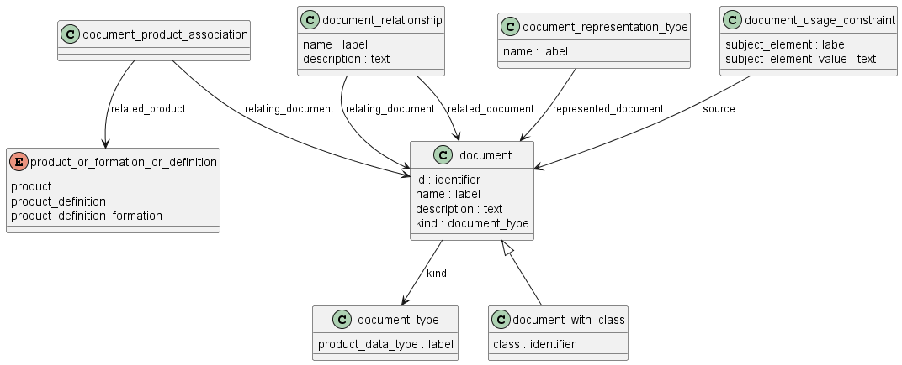

Схема document_schema на языке Express для идентификации и описания свойств изделия приведена в ГОСТ Р ИСО 10303-41-2022. Ниже приводится описание применения данной схемы для целей описания свойств изделий машиностроения и их СЧ, разрабатываемых в соответствии со стандартами СПЖЦ и ЕСКД.

Предметом document_schema являются ссылки на документы по стандартизации или другие технические документы, не являющиеся непосредственно частью описания изделия (комплекта КД, ТД и т.п.). 

Данные о продукте могут включать ссылки на другие источники информации, относящиеся к описанию продукта.

ПРИМЕР: Ссылки на документы с требованиями к процессу термообработки могут быть включены в описание изделия с использованием объектов, определенных в этой схеме.

ПРИМЕР: Ссылочными документами могут быть, например, документы по стандартизации (международные, медгосударственные, национальные стандарты, ТУ, стандарты организации), каталоги поставщиков, таблицы инженерных данных и т.п.

## Описание документа

В атрибуте id указывается уникальный идентификатор документа. В атрибуте label -  наименование документа. В необязательном атрибуте description - описание документа. 

В атрибуте kind указывается вид документа, который выбирается из перечня видов документов, применяемых в организации.

С каждым документом может быть связан один или несколько видов представлений (бумажное, электронное в формате 1, электронное в формате 2 и т.п.), описанных объектом document_representation_type

Конкретизация ссылки на документ выполняется с использованием объекта document_usage_constraint, который идентифицирует конкретную предметную область, аспект, раздел, подраздел, пункт документа, на который дается ссылка. При необходимости содержание ссылочной информации может быть приведено в атрибуте subject_element_value.

ПРИМЕР. При ссылке на документ, определяющий требования к качеству поверхности значение атрибута subject_element может быть «качество поверхности согласно пункту 2.1», а соответствующее значение атрибута subject_element_value может быть «отсутствие видимых дефектов», «не более двух дефектов диаметром более 0,06 дюйма на любом квадратном дюйме поверхности» или «отсутствие дефектов при 10-кратном увеличении».

## Связь документа с описанием изделия

Ссылочное описание документа может быть связано с изделием (product), версией изделия (product_definition_formation) или с описанием изделия в контексте (product_definition) с использованием объекта document_product_association.

Также с использованием данного объекта можно установить эквивалетность между ссылочным описанием и описанием "document as product" одного и того же документа, что позволит отслеживать версии ссылочного документа.