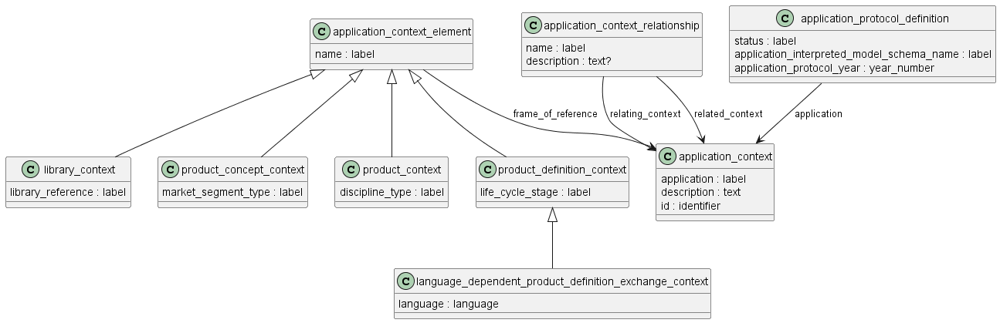

Схема application_context на языке Express приведена в ГОСТ Р ИСО 10303-41-2022. Ниже приводится описание применения данной схемы для идентификаций контекста, в котором производится определение свойств изделий машиностроения и их СЧ, разрабатываемых в соответствии со стандартами СПЖЦ и ЕСКД.

Предметом схемы application_context_schema является указание контекста (контекста применения) при описании изделия и его свойств. Эта схема предоставляет механизм для определения системы отсчета или контекста, который применяется к конкретным наборам данных о продукте. Эта схема также предоставляет средства для идентификации прикладных протоколов.

*Возможно, нам надо данную модель рассматривать как прикладной протокол и определить конкретную его идентификацию здесь? А также конкретный контекст, связанный с данной моделью*

Для полноценного обмена данными о продукте требуется идентификация контекста применения, в котором эти данные о продукте определены. Контекст применения может содержать несколько элементов контекста. На каждый элемент контекста может ссылаться отдельный набор данных о продукте.

*Возможно, нам надо здесь определить конкретные элементы контекста (например, для ЭСК, ЭГМ, схемы определенного вида и типа и т.п.)?*

Контекст применения - это контекст, в котором определяются и имеют значение данные о продукте. Объект application_context объединяет различные типы информации, которые относятся к данным о продукте и могут влиять на значение и использование этих данных. Разные типы информации связываются с элементами контекста (application_context_element), определенными для данного контекста применения.

Каждый элемент контекста определяет один из аспектов контекста применения.

application_context_element — это аспект контекста применения, содержащий информацию о контексте, в котором определены данные о продукте. Этот аспект содержит информацию об условиях, в которых существуют данные о продукте.
Элемент application_context_element может быть либо library_context, либо product_concept_context, либо product_context, либо product_definition_context.

**Библиотечный_контекст (library_context)** — определяет контекст для элементов библиотеки. НСИ?

Унаследованный атрибут name идентифицирует или характеризует тип библиотеки.

ПРИМЕЧАНИЕ 1. Атрибут name может отражать природу источника библиотеки, природу содержимого библиотеки или и то, и другое.

ПРИМЕР 1. Примерами типов библиотеки являются «Dewey Decimal», «ISO 13584 library» и «supplier catalog».

**Контекст концепции продукта (product_concept_context)** — определяет контекст для концепции_продукта (см. ISO 10303-44).
Это информация, относящаяся к характеристике потенциальных покупателей продукта. Такая информация может повлиять на значение и использование данных о продукте.  В атрибуте market_segment_type указывается тип потребительских предпочтений, связанных с продуктом.

**Контекст изделия (product_context)** — определяет представляющий информацию о продукте, не зависящую от жизненного цикла. Эта информация описывает дисциплину, в рамках которой создаются данные о продукте.

ПРИМЕЧАНИЕ 1. Различные аннотированные схемы EXPRESS, использующие или специализирующие этот тип данных сущности, могут использовать общие значения атрибутов типа данных сущности product_context для обеспечения согласованности между схемами, относящимися к одним и тем же типам или видам продуктов.

ПРИМЕР 1. Две аннотированные схемы EXPRESS, определяющие структуры данных о продукте для проектирования и строительства зданий соответственно, могут ограничивать значения атрибута name значением «building» (здание), а атрибута discipline_type — значением «architecture» (архитектура).

Унаследованный атрибут "name" идентифицирует конкретную отрасль, предметную область или вид продукта, для которого создаются или используются данные о продукте.

ПРИМЕЧАНИЕ 2. Значение этого атрибута может быть определено в аннотированных схемах EXPRESS, которые используют или специализируют эту сущность, или в соглашении о взаимопонимании между партнерами, разделяющими эту информацию.

ПРИМЕР 2. «Корабль», «Самолет» и «Здание» — примеры названий контекстов продукта.

втрибут "discipline_type" - это метка, идентифицирующая конкретную область практики, связанную с созданием или использованием данных о продукте.

ПРИМЕЧАНИЕ 3. Значение этого атрибута может быть определено в аннотированных схемах EXPRESS, которые используют или специализируют эту сущность, или в соглашении о взаимопонимании между партнерами, обменивающимися этой информацией.

ПРИМЕР 3. Примерами типов дисциплин являются «электроника», «инжиниринг» или «архитектура».

**Контекст описания изделия (Product_definition_context)** — представляет информацию об этапе жизненного цикла продукта, для которого создается или используется product_definition.

ПРИМЕЧАНИЕ 1. Различные аннотированные схемы EXPRESS, использующие или специализирующие этот тип данных сущности, могут использовать общие значения атрибутов типа данных сущности product_definition_context для поддержания согласованности между схемами, относящимися к одним и тем же или связанным этапам жизненного цикла.

ПРИМЕР 1. Две аннотированные схемы EXPRESS, определяющие структуры данных продукта для концептуального проектирования и детального проектирования технологических установок соответственно, могут ограничивать значения атрибута name значениями «концептуальный проект» и «детальный проект», а атрибута life_cycle_stage — значением «проект».

Унаследованный атрибут name определяет подраздел или характеристику этапа жизненного цикла, для которого создаются или используются данные о продукте.

ПРИМЕЧАНИЕ 2. Значение этого атрибута может быть определено в аннотированных схемах EXPRESS, которые используют или специализируют эту сущность, или в соглашении о взаимопонимании между партнерами, обменивающимися этой информацией.

ПРИМЕР 2. «Требуется» и «Планируется» — примеры названий контекстов определения продукта, используемых вместе с этапом жизненного цикла «термический анализ».

Атрибут life_cycle_stage - содержит обозначение  этапа жизненного цикла продукта.

ПРИМЕЧАНИЕ 3. Значение этого атрибута может быть определено в аннотированных схемах EXPRESS, которые используют или специализируют эту сущность, или в соглашении о взаимопонимании между партнерами, обменивающимися этой информацией.

ПРИМЕР 3. «Предварительное проектирование» и «Планирование производства» являются примерами этапов жизненного цикла.

*Нужно в стандарте устанавливать конкретные значения для всех этих контекстов!!!*

## Связь между контекстами

application_context_relationship — это отношение между двумя экземплярами application_context, описывающее это отношение.

ПРИМЕЧАНИЕ 1. Роль application_context_relationship может быть определена в аннотированных схемах EXPRESS, которые используют или специализируют эту сущность, или, по умолчанию, в соглашении о взаимопонимании между партнерами, совместно использующими эту информацию.

ПРИМЕЧАНИЕ 2. Без какой-либо дальнейшей специализации это отношение не подразумевает, что данные о продукте, связанные с relating_context, также связаны с related_context.

ПРИМЕЧАНИЕ 3. Отношения, представленные с использованием этой сущности, могут быть родительско-дочерними отношениями. Аннотированные схемы EXPRESS, которые используют или специализируют эту сущность, указывают, является ли отношение направленным.