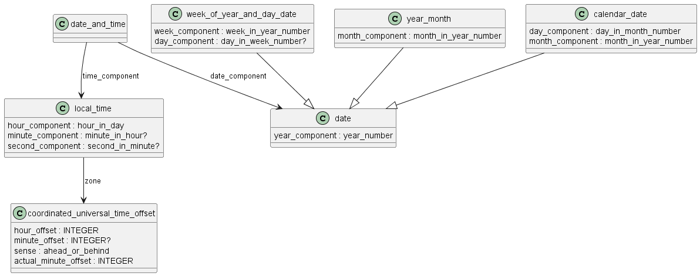

Схема date_time на языке Express приведена в ГОСТ Р ИСО 10303-41-2022. Ниже приводится описание применения данной схемы для идентификаций времени при описании изделия машиностроения (дата изготовления, дата поставки, дата ремонта и т.п.).

Предметом схемы date_time_schema является определение дат (как календарных, так и порядковых), времени суток, комбинаций даты и времени суток, а также периодов времени.

Любые данные о продукте могут иметь связанную с ними дату, время или дату и время.

Дата (date) — это обозначение дня, недели или месяца в году. Дата может быть календарной, порядковой, датой недели_года_и_дня или датой года_месяца. Определение даты дано в стандарте ISO 8601.