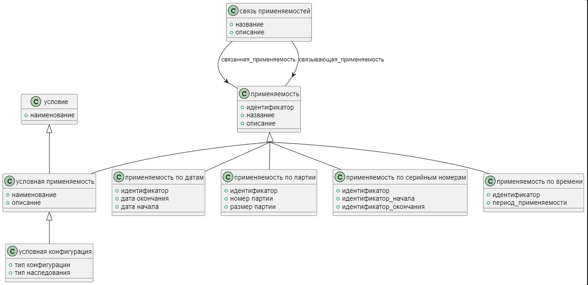

Схема effectivity на языке Express приведена в ГОСТ Р ИСО 10303-41-2022. Ниже приводится описание применения данной схемы для указания применяемости (*такое ощущение, что это не применяемость, а информация о внедрении - как в 2.503*)при описании изделия машиностроения.

Предметом схемы effectivity_schema является валидность аспектов данных о продукте или данных о деятельности жизненного цикла продукта, заданных в соответствии с определенными критериями.

Эта схема поддерживает указание применяемости (внедрения) следующими способами:

- указание партии изделия;
- указание серийного номера изделия;
- указание даты.

Информация о применямости  (внедрении) может быть добавлена ​​к любому аспекту данных о продукте или данных о жизненном цикле продукта.
В данной схеме рассматриваются только данные о вступлении в силу, основанные на дате, серийном номере и номере партии.

