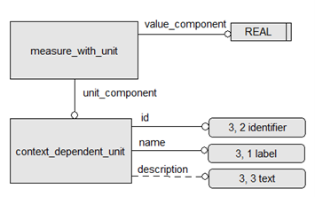
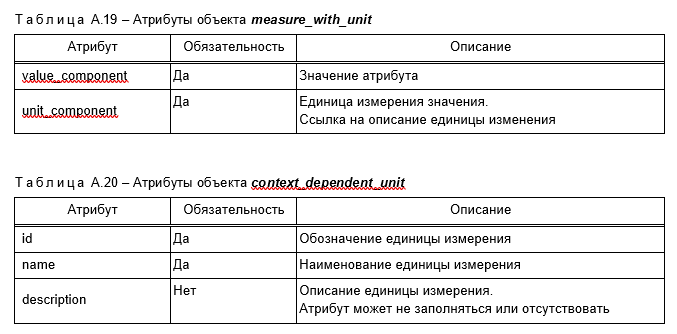
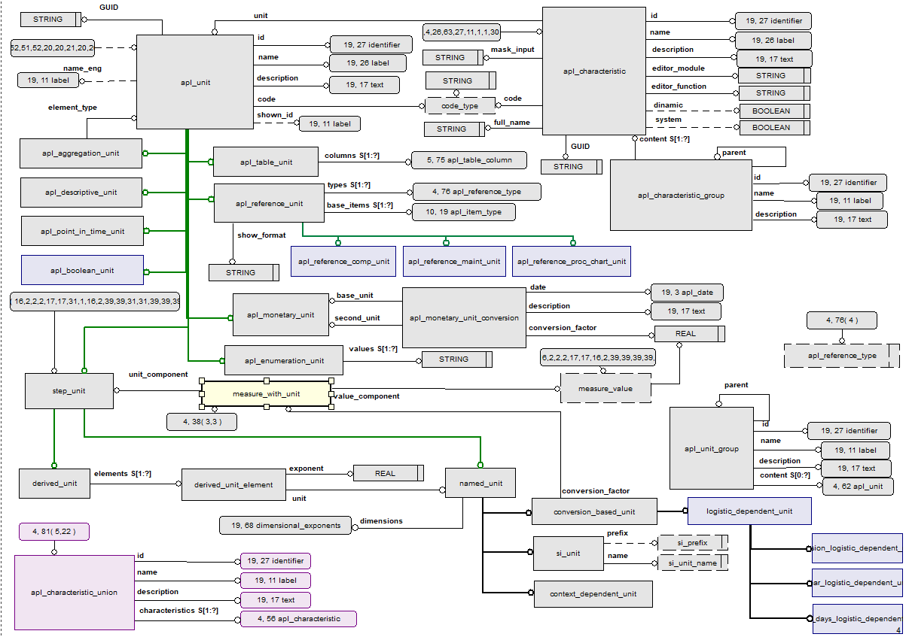

### Что уже написано в ГОСТ Р 2.525:

А.5 Значение с единицей измерения

А.5.1 Некоторые атрибуты объектов задаются путем указания значения в определенной единице измерения. Для этого используется объект measure_with_unit (см. рисунок А.14), который ссылается на конкретное описание единицы измерения (context_dependent_unit).

А.5.2 Атрибуты объектов measure_with_unit и context_dependent_unit приведены в таблицах А.19 и А.20

### Такая схема в PSS:

### Что написано в 10303 про measure_schema

Данная схема поддерживает следующие требования:

- должна быть возможность указывать предопределенные виды физических величин, если вид физической величины известен на момент определения схемы;
  
- должна быть предусмотрена возможность указания непредустановленных видов физических величин, если вид физической величины неизвестен на момент задания схемы.

ПРИМЕР Элементами списка свойств материала являются физические величины. Каждый элемент может быть физической величиной другого типа. Выбор типа каждого элемента осуществляется только во время создания экземпляра.

========================================

The following requirements are supported by this schema:

- it shall be possible to specify the predefined kinds of physical quantity if the kind of a physical quantity is known at the time when the schema is being specified;
  
- it shall be possible to specify non-predefined kinds of physical quantity if the kind of a physical quantity is not known at the time when the schema is being specified.

EXAMPLE    The elements of a list of material properties are physical quantities. Each element may be a different kind of physical quantity. The kind of each element is only decided upon at instantiation time.
