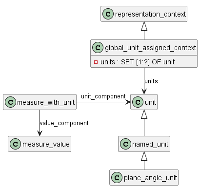
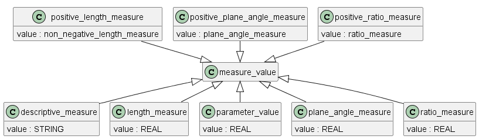

## unit
Тип "единица измерения" - это список альтернативных типов данных. Он предоставляет механизм для ссылки на экземпляр одного из этих типов данных. Единица измерения - это физическая величина, значение которой равно единице.

ПРИМЕЧАНИЕ. Единица измерения используется для выражения других физических величин того же типа.

The unit type is a list of alternate data types. It provides a mechanism to refer to an instance of one of these data types. A unit is a physical quantity, with a value of one.
NOTE    A unit is used to express other physical quantities of the same kind.

## named_unit

Именованая единица измерения - это единичное количество.

Атрибут "dimensions": показатели базовых свойств, с помощью которых определяется именованная единица измерения.

dimensional_exponents - это определение степеней измерения семи базовых величин.

ПРИМЕЧАНИЕ 1. Семь базовых величин определены в стандарте ISO 31.

ПРИМЕЧАНИЕ 2. Этот объект позволяет выражать размерность любой физической величины относительно этих семи базовых величин.

ПРИМЕЧАНИЕ 3. Длина, масса, время, электрический ток, термодинамическая температура, количество вещества и сила света являются семью базовыми величинами.

ПРИМЕР 1. Длина в 2 миллиметра имеет показатель длины, равный 1. Остальные показатели равны 0.

ПРИМЕР 2 Скорость, равная 2 миллиметрам в секунду, имеет показатель длины, равный 1, и показатель времени, равный -1. Остальные показатели равны 0.

Атрибуты dimensional_exponents:

length_exponent: значение базовой величины длины.

mass_exponent: значение базовой величины массы.

time_exponent: значение базовой величины времени.

electric_current_exponent: мощность базовой величины электрического тока.

thermodynamic_temperature_exponent: мощность базовой величины термодинамической температуры.

amount_of_substance_exponent: показатель, отражающий количество вещества.

luminous_intensity_exponent: показатель, отражающий базовую величину силы света.

================================================

A named_unit is a unit quantity

dimensions: the exponents of the base properties by which the named_unit is defined.

A dimensional_exponents is a definition of the powers of the dimensions of the seven base quantities.
NOTE 1   The seven base quantities are defined in ISO 31.

NOTE 2   This entity enables the dimensional expression of any physical quantity with respect to these seven base quantities.

NOTE 3   Length, mass, time, electric current, thermodynamic temperature, amount of substance, and luminous intensity are the seven base quantities.

EXAMPLE 1   A length of 2 millimetres has a length exponent of 1. The remaining exponents are equal to 0.

EXAMPLE 2   A velocity of 2 millimetres per second has a length exponent of 1 and a time exponent of -1. The remaining exponents are 0.

## plane_angle_unit

plane_angle_unit - это тип named_unit, в котором выражаются углы на плоскостях.

Все размерные показатели dimensional_exponents должны быть равны нулю.

=================================

A plane_angle_unit is a type of named_unit in which angles in planes are expressed.

All the dimensional exponents shall be equal to zero.

## measure_with_unit

measure_with_unit - это спецификация физической величины, как определено в стандарте ISO 31.

Атрибуты:

value_component: значение физической величины, выраженное относительно unit_component.

unit_component: единица измерения, в которой выражается физическая величина.

Параметр unit_component должен быть допустимой единицей измерения для того типа измерения, который указан в параметре value_component.

================================================

A measure_with_unit is the specification of a physical quantity as defined in ISO 31. 

value_component: the value of the physical quantity if expressed with respect to the unit_component.

unit_component: the unit in which the physical quantity is expressed.

## masure_value

Тип measure_value представляет собой список альтернативных типов данных. Он предоставляет механизм для ссылки на экземпляр одного из этих типов данных. 

measure_value - это значение, определенное в стандарте ISO 31-0.

===================================

The measure_value type is a list of alternate data types. It provides a mechanism to refer to an instance of one of these data types. A measure_value is a value as defined in ISO 31-0.

## global_unit_assigned_context

Гglobal_unit_assigned_context - это тип представления_контекста, в котором единицы измерения применяются ко всем измеряемым значениям соответствующего вида.

ПРИМЕЧАНИЕ. Пример использования этого объекта приведен в приложении F.3.6.

F.3.6 Use of global_unit_assigned_context

F.3.6 Использование global_unit_assigned_context
Следующий набор примеров определяет контекст трехмерного геометрического представления (#604), в котором плоские углы выражены в радианах, телесные углы выражены в стерадианах, а длины выражены в миллиметрах.

EXPRESS specification

#3=(NAMED_UNIT(*)SI_UNIT($,.STERADIAN.)SOLID_ANGLE_UNIT());

#4=(LENGTH_UNIT()NAMED_UNIT(*)SI_UNIT(.MILLI.,.METRE.));

#5=(NAMED_UNIT(*)PLANE_ANGLE_UNIT()SI_UNIT($,.RADIAN.));

#604=(GEOMETRIC_REPRESENTATION_CONTEXT(3)  
GLOBAL_UNIT_ASSIGNED_CONTEXT( (#4,#5,#3))
REPRESENTATION_CONTEXT('l-bracket','3D'));

==============================================

A global_unit_assigned_context is a type of representation_context in which the units apply to all measure_values of the applicable kind.
NOTE    For an example of the use of this entity, see annex F.4.6.