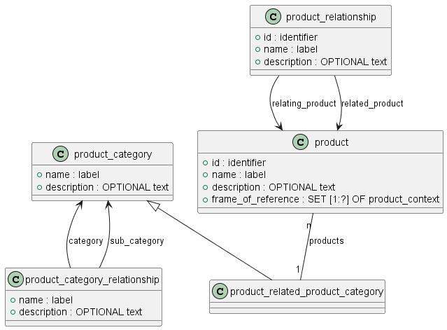

Для описания изделий и их СЧ используются следующие основные объекты:
- product  - Изделие (составная часть)
- product_definition_formation  - Версия изделия (составной части);
- product_definition  - Описание изделия (составной части) в контексте.

## Изделие

Объект product (изделие) описывает:
- само изделие (сборочная единица, комплекс, комплект);
- СЧ изделия;
- материал (заготовку), из которого изготавливается изделие.
Примечание – Здесь и далее для любой сущности, входящей в ЭСК и описываемой  объектом product, будет использоваться слово «изделие», независимо от того, является ли элемент ЭСК изделием по ГОСТ Р 2.101 (деталь, сборочная единица, комплекс, комплект) или материалом, заготовкой, программным изделием, базой данных или виртуальной сборочной единицей.

Для изделий, идентифицируемых как исполнения базового изделия по ГОСТ 2.113, объект product может описывать каждое исполнение отдельно и семейство изделий в целом. 
Для сложных изделий, изготавливаемых во множестве вариантов (например, модификаций )), объект eskd_product может описывать каждую модификацию отдельно и тип ) (семейство) изделий в целом.
Примечание – Примерами типа изделия являются самолет ТУ-214, вертолет МИ-17.

### Классификация изделий
Изделия могут быть классифицированы путем отнесения к одной или нескольким категориям (product_category)

### Связи между изделиями
Изделия могут быть связаны между собой связями разных типов. Например, это может быть связь между семейством изделий и отдельным членом семейства. Связи между изделиями устанавливаются с использованием стандартного объекта product_relationship (связь между изделиями) 

## Версия изделия

В ходе разработки изделия может возникнуть необходимость идентифицировать разные версии одного изделия, появляющиеся в ходе внесения изменений.
Под версией изделия понимается вариант изделия, появившийся в результате внесения таких изменений в конструкцию изделия, характер которых не требует присвоения изделию нового обозначения (в соответствии с требованиями ГОСТ Р 2.503), при этом требуется идентифицировать отличающиеся характеристики изделия (например, материал изготовления, цвет покрытия, состав сборочной единицы).

Для описания версии изделия в ЭСК используется специализированный объект eskd_product_definition_formation (см. рисунок А.5), который наследует атрибуты от стандартных объектов product_definition_formation и product_definition_formation_with_specified_source по ГОСТ Р ИСО 10303-44.

Любое изделие (включая неразрабатываемые СЧ: покупные и стандартные изделия) должно иметь хотя бы одну версию.

### Связи между версия изделий
АВерсии изделия могут быть связаны между собой связями разных типов. Например, это может быть связь между данной версий изделия и версией, на основе которой создана данная версия.
Допускается устанавливать связи между версиями разных изделий. Правила применения такой связи устанавливают в стандарте организации и (или) по соглашению между участниками обмена данными.
Связи между версиями изделия устанавливаются с использованием стандартного объекта product_definition_formation_relationship (связь между версиями изделия)

## Описание изделия в контексте

Концепция ГОСТ Р ИСО 10303-41 в части представления данных об изделии заключается в том, что одно изделие (версия) может быть относительно независимо описано с разных точек зрения (в разных контекстах).
Например, при разработке видов структур, отличных от конструктивной (не рассматриваемых в настоящем стандарте – функциональной, технологической, эксплуатационной и т. д.), понятие контекста позволит передавать между организациями в одном обменном файле различные виды структуры одного изделия, необходимые для решения различных задач. Такой контекст можно идентифицировать наименованием решаемой задачи – функциональный, конструкторский и т. д.

Для описания изделия в конкретном контексте в модели данных используется стандартный объект product_definition (описание изделия) по ГОСТ Р ИСО 10303-41

### Связи между описаниями изделия в контексте

Два описания одного изделия в разных контекстах или два описания разных изделий (в одном контексте) могут быть связаны между собой. На связях между описаниями разных изделий в одном контексте («конструктивная структура») строится формирование ЭСК (см. А.3).

Связь между описаниями изделия представляется объектом product_definition_relationship (связь между описаниями) – см. рисунок А.8.