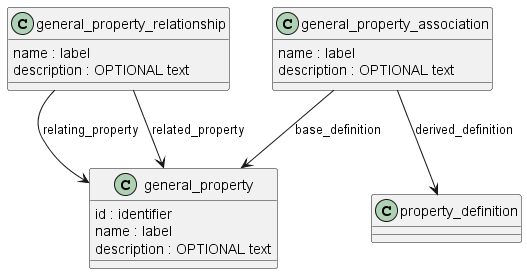
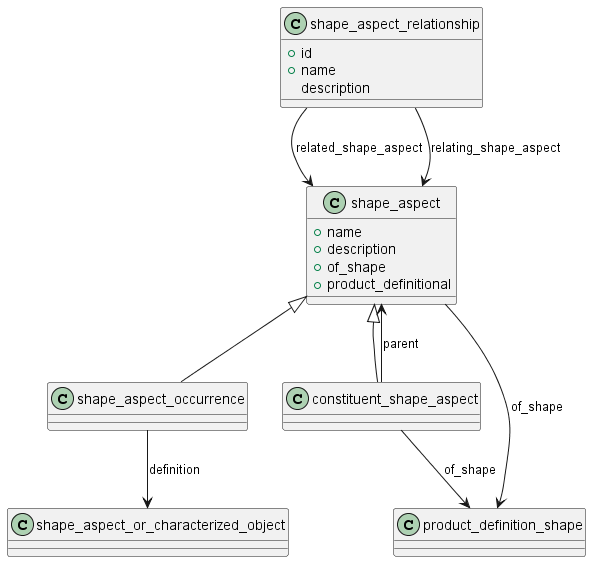

Схема product_property_definition на языке Express для идентификации и описания свойств изделия приведена в ГОСТ Р ИСО 10303-41-2022. Ниже приводится описание применения данной схемы для идентификаций свойств изделий машиностроения и их СЧ, разрабатываемых в соответствии со стандартами СПЖЦ и ЕСКД.

Эта схема предоставляет ресурсы для описания:

- типов (номенклатыры, наименований) свойств, подлежащих идентификации и описанию;
- конкретных свойств объектов, описанных с использованием characterized_object, product_definition, product_definition_relationship или shape_definition.

**Термин:** Свойство продукции: Объективная особенность продукции, которая может проявляться при ее создании, эксплуатации или потреблении [ГОСТ 15467-79]

**Термин:** Показатель качества продукции: Количественная характеристика одного или нескольких свойств продукции, входящих в се качество, рассматриваемая применительно к определенным условиям се создания и эксплуатации или потребления [ГОСТ 15467-79]

**Термин:** Признак продукции: Качественная или количественная характеристика любых свойств или состояний продукции [ГОСТ 15467-79]

**Термин:** Параметр продукции: Признак продукции, количественно характеризующий любые ее свойства или состояния [ГОСТ 15467-79]

______________
Практические различия
«Свойство» отвечает на вопрос «что есть у объекта?» (например, прочность, цвет, безотказность). Оно может быть простым или сложным и не обязано иметь числовое выражение.

«Характеристика» описывает свойства/состояния — как качественно (например, «гладкая поверхность»), так и количественно (например, «шероховатость Ra 0,8 мкм»). Это общий термин описания.

«Показатель» — это именно числовая мера свойства в заданных условиях (например, предел прочности 500 МПа; безотказность с интенсивностью отказов λ). Показатели используются для нормирования, сопоставления и принятия решений о соответствии.

Дополнительные пояснения из практики
В учебно‑методических и прикладных источниках подчёркивается: простые свойства выражаются конкретным показателем, а сложные (например, «надёжность») агрегируются из группы показателей (безотказность, долговечность и др.).

Для разных видов продукции серия ГОСТ 4.x перечисляет «номенклатуры» основных показателей по группам свойств (например, для приборов, строительных материалов, изделий со стабильными изотопами), что демонстрирует применение общих дефиниций к отраслям.

Где искать формулировки
Точные формулировки дефиниций — в таблицах терминов ГОСТ 15467‑79 (раздел с общими понятиями и показателями качества).

Примеры групп показателей и их назначение в оценке качества — в соответствующих ГОСТ 4.x и методических разделах по номенклатурам показателей.

________

ПРИМЕР 1. Определение свойства "шероховатость поверхности" (тип свойства) для определенной формы (изделия) не зависит от способа представления самой формы или способа представления шероховатости поверхности.

ПРИМЕЧАНИЕ. В предыдущем примере как определяемая шероховатость поверхности, так и форма могли иметь несколько представлений.

Каждое свойство может быть связано с одним characterized_object или product_definition или с одним product_definition в контексте другого. Каждое свойство не зависит от количества или типов представлений этой свойства. Каждое свойство может быть связано с формой продукта, элементом формы продукта или отношением между элементами формы продукта.

В схеме проводится различие между определением продукта (definition of a product) (как отдельного предмета со своими уникальными характеристиками) и его возможными применениями (its possible usages) (например, в конструкции другого изделия, в определенной среде эксплуатации и т.п.). 

В схеме установлены следующие допущения:

1) Определение данного объекта характеризуется набором уникальных свойств.

ПРИМЕР 2 Продукт не может иметь две формы одновременно.

2) Любое применение объекта характеризуется также набором уникальных свойств.

ПРИМЕР 3 Продукт, например, клей, может иметь разные формы в зависимости от его применения.

3) Свойство характеризует либо определение, либо одно из применений объекта.

ПРИМЕР 4 Внешний вид стула x является уникальным свойством этого стула. Цвет, обозначающий, что стул белый, является единственным элементом в представлении свойства внешнего вида стула x. Этот цвет является общим для многих представлений свойств многих различных объектов.

The appearance of chair x is a unique property of that chair. The colour designating that the chair is white is a single item in a representation for the appearance property of chair x. This colour is shareable among many representations for the properties of many different objects.

## Тип свойства

Тип (уникальное наименование) свойства описывается объектом general_property

Между двумя типами свойств могут быть установлены связи (general_property_relationship). Тип связи определяется для конкретного контекста применения. Например, это может быть связь типизации (общее-частное): безотказноть - параметр потока отказов.

С использованием объекта general_property_association устанавливается связь между типом свойства и конкретным свойством конкретного объекта (property_definition).

## Свойство конкретного объекта

Property_definition — это свойство, характеризующее отдельный объект.
Наименование каждого конретного свойства может быть определено либо его связью с типом свойства, либо его атрибутом name.

Product_definition_shape — это подтип property_definition. Это свойство, определяющее форму объекта. 

ПРИМЕЧАНИЕ 1. Product_definition_shape не обязательно должен быть связан с каким-либо геометрическим представлением.

ПРИМЕЧАНИЕ 2. На начальном этапе проектирования продукта может отсутствовать конкретная идея о форме продукта, но могут быть определенные характеристики формы, которые необходимо представить. Эти характеристики формы продукта можно прикрепить к форме продукта с помощью этой сущности.

ПРИМЕР. Геометрическое представление формы не требуется для утверждения таких фактов, как «форма должна помещаться в куб с длиной ребра 5 см».

Свойство объекта должно быть связано с самим объектом. Для установления такой связи используется атрибут definition объекта Property_definition. Этот атрибут может ссылаться на один из следующих объектов:
- product_definition_shape
- shape_aspect_relationship
- shape_aspect
- characterized_object
- product_definition_relationship
- product_definition
- product_definition_occurence

A shape_aspect is an identified element of the shape of an object or is part of another shape_aspect.
NOTE 1   A shape_aspect that is part of another shape_aspect allows decomposition of a shape_aspect.

## Элемент формы 

Элемент формы (shape_aspect) — это идентифицированная часть формы объекта или часть другого элемента формы (shape_aspect).

ПРИМЕЧАНИЕ 1. Элемент формы (shape_aspect), являющийся частью другого элемента формы (shape_aspect), допускает декомпозицию элемента формы (shape_aspect).

ПРИМЕР 1. Рассмотрим свойство, определяющее форму (product_definition_shape) болта. В качестве элемента этой формы можно выделить понятие резьбовой части его стержня. Эта часть формы может быть задана с помощью сущности shape_aspect, чтобы с ней можно было связать другие свойства, такие как качество поверхности.

Логический атрибут данного объекта product_definitional позволяет указать признак того, что данный shape_aspect находится на физической границе формы объекта (product_definition_shape). Если значение этого атрибута равно TRUE, идентифицируемый shape_aspect находится на такой границе. Если значение равно FALSE, идентифицируемый shape_aspect не находится на такой границе. Если значение равно UNKNOWN, неизвестно, находится ли идентифицируемый shape_aspect на такой границе.

ПРИМЕР 3. Если идентифицированный shape_aspect является резьбовой частью стержня болта, значение этого атрибута будет TRUE. Если это осевая линия, значение будет FALSE.

Объект shape_aspect может быть определен как часть другого элемента формы (подтип constituent_shape_aspect), а также может определяться другим элементом формы или другим объектом (подтип shape_aspect_occurrence) (оба подтипа могут былть определены одновременно), который указан в атрибуте definition.

## Связь между двумя элементами формы

Отношение shape_aspect_relationship представляет собой отношение между двумя экземплярами типа данных сущности shape_aspect и обеспечивает идентификацию и описание их отношения.

ПРИМЕЧАНИЕ 1. Роль shape_aspect_relationship может быть определена в аннотированных схемах EXPRESS, которые используют или специализируют эту сущность, или, по умолчанию, в соглашении о взаимопонимании между партнерами, разделяющими эту информацию.

ПРИМЕЧАНИЕ 2. Если один shape_aspect является частью другого, эта сущность может использоваться для связи двух shape_aspect.

ПРИМЕЧАНИЕ 3. Каждая сущность shape_aspect может иметь разные свойства.

ПРИМЕЧАНИЕ 4. Между связанными экземплярами типа данных сущности shape_aspect не устанавливается никакой фактической физической связи.

ПРИМЕР 1. Отношение shape_aspect_relationship может связывать два экземпляра типа данных сущности shape_aspect, представления которых представляют собой эквивалентные поверхности формы и отлитого изделия. Форма формы не связана пространственно с отлитым изделием.

ПРИМЕЧАНИЕ 5. Отношения, представленные с использованием этой сущности, могут быть родительско-дочерними отношениями. Аннотированные схемы EXPRESS, которые используют или специализируют эту сущность, указывают, является ли отношение направленным.