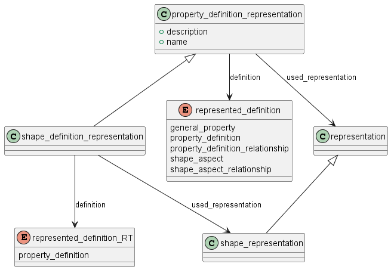
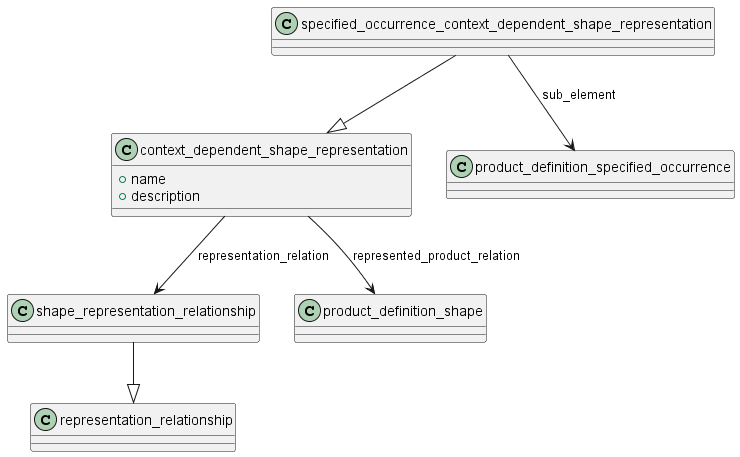

Схема product_property_representation на языке Express для представления свойств изделия приведена в ГОСТ Р ИСО 10303-41-2022. Ниже приводится описание применения данной схемы для представления свойств изделий машиностроения и их СЧ.

Представления описаны в ГОСТ Р 77.304 "Представление свойств изделия". Представление - это коллекция экземпляров объектов (разных), которая в совокупности что-то "представляет" (например, коллекция геометрических элементов совместно описывающая форму)

Схема предоставляет следующие возможности:

- связывать представление свойства с определением свойства (property_definition);
- идентифицировать представление как форму;
- идентифицировать связи между представлениями форм и утверждать, что выявленные связи являются представлениями нуля, одного или нескольких экземпляров сущности product_definition.

1) схема охватывает разные типы представлений, от простых наборов геометрических фигур до более сложных наборов представлений различных видов свойств;

2) возможно наличие более одного представления одного свойства;

3) одно представление может использоваться для представления свойства  нуля, одного или нескольких экземпляров  сущности product_definition;

4) любое свойство product_definition является идентифицируемым понятием независимо от того, как оно представлено и представлено ли вообще.

## Определение свойства и представление свойства

Связь между определение свойства и представлением этого свойства описывается объектом property_definition_representation, который в атрибуте represented_definition ссылается на тип свойства, конкретное свойство или элемент формы, который имеет представление. А в атрибуте "used_representation" - ссылается на это представление.

Если представление свойства зависит от применения изделия в структуре другого изделия, то используется объект context_dependent_shape_representation.

## Представление, зависящее от положения в структуре

Context_dependent_shape_representation – это связь shape_representation_relationship с product_definition_relationship. 

- shape_representation_relationship — это связь между представлениями формы, в котором хотя бы одно из связанных представлений является представлением_формы (shape_representation).

ПРИМЕР: Представление формы болта может быть связано с представлением положения (representation of a position), если болт является частью сборки.

Атрибут related_product_definition в product_definition_relationship устанавливает контекст для shape_representation_relationship. 

Атрибут rep_2 в shape_representation_relationship определяет shape_representation, связанное с этим контекстом. 

Атрибут rep_1 в shape_representation_relationship определяет shape_representation, связанное с атрибутом related_product_definition в product_definition_relationship. 

Утверждения о том, что связанные отношения являются дефиниционными, должны быть указаны в аннотированной схеме EXPRESS, которая использует или специализирует данную сущность, включая специализации или использование атрибута transform_operator в represent_relationship_with_transformation. 

ПРИМЕЧАНИЕ 1. ISO 10303 определяет критическую ассоциативность между геометрией и топологией, которая тщательно определена и ограничена для обеспечения воспроизводимости, надежности, устойчивости и полноты, необходимых при моделировании промышленных изделий на основе проверенных математических основ (например, см. раздел «Схема геометрической модели» ISO 10303-42). 

ISO 10303 использует методологию построения гибридных структур изделий (негеометрических) и (геометрических) моделей сборок, которые связывают тензорное преобразование жесткого тела для размещения геометрических моделей деталей в геометрической модели сборки. Эти гибридные структуры разлагают связь с преобразованием и само преобразование на отдельные EXPRESS-конструкции; однако они спроектированы и интегрированы для функционирования как единой модели.

ПРИМЕЧАНИЕ 2. AP, который решает создать специализацию represent_relationship_with_transformation, которая также является специализацией shape_representation_relationship, с дополнительной характеристикой, заключающейся в том, что специализация определяет set_representation_item в роли transform_operator, изменяет стандартную интерпретацию context_dependent_shape_representation, которая не является спецификацией тензорного преобразования, а становится спецификацией ассоциации. Эта ассоциация не является дефиниционной и, следовательно, не переносит определение исходной модели в целевую. Поэтому пользователям и разработчикам следует использовать её с осторожностью, чтобы понимать её конкретную конструкцию, ограничения и условия.

ПРИМЕЧАНИЕ 3. Интерпретация того, указано ли преобразование или ассоциация, содержится в пункте 4.2 стандарта ISO 10303-43, поскольку она зависит от того, какие типы используются в роли атрибута transform_operator в represent_relationship_with_transformation.

ПРИМЕЧАНИЕ 4. Включение частично сложного экземпляра represent_relation в definitional_representation_relationship, когда та же совокупность данных определяет ассоциацию, приводит к недопустимым данным.

ПРИМЕР 1. Протокол приложения определяет преобразование между (искажённой) формой прокладки в контексте сборки и формой этой сборки с помощью экземпляра context_dependent_shape_representation. В связи с этим объявлением context_dependent_shape_representation является определяющим, и целевая модель при визуализации в CAD-системе будет включать искажённую форму прокладки. Существует отдельный набор отношений, связывающих (неискажённую) форму прокладки с (искажённой) формой прокладки, которые не объявлены в совокупности context_dependent_shape_representation.

ПРИМЕР 2. Протокол приложения объявляет, что context_dependent_shape_representation определяет набор ассоциаций между элементами в shape_representations, заданных атрибутами rep_1 и rep_2 совокупности represent_relationship. В связи с этим объявлением context_dependent_shape_representation не является определяющим, и целевая модель (rep_2 из represent_relationship) при визуализации в CAD-системе не включает элементы исходной модели (rep_1 из represent_relationship). Внешнее приложение для оценки качества оценивает набор ассоциаций и целевую модель на соответствие внешним критериям.

ПРИМЕЧАНИЕ 5 Роль context_dependent_shape_representation может быть определена в аннотированных схемах EXPRESS, которые используют или специализируют эту сущность, или, по умолчанию, в соглашении о взаимопонимании между партнерами, разделяющими эту информацию.

ПРИМЕЧАНИЕ 6 Форма прокладки в ПРИМЕРЕ 1 использует определяющее context_dependent_shape_representation, поскольку context_dependent_shape_representation задаёт преобразование.

ПРИМЕР 3 Положение формы болта в данной сборке является определяющим, и, следовательно, context_dependent_shape_representation задаёт преобразование.

ПРИМЕР 4 Форма прокладки зависит от того, участвует ли прокладка в сборке, и, если она является частью сборки, от изделия или изделий, с которыми она собирается.