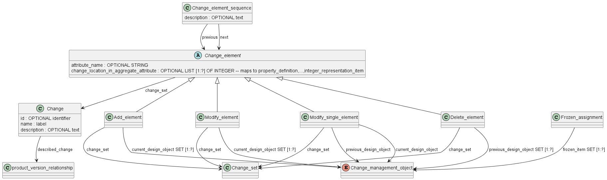

## Управление изменениями

## Part 1824: Application module: Change management

В данной части ISO 10303 описан прикладной модуль «Управление изменениями». В сферу действия данной части ISO 10303 входят следующие элементы:

- идентификация изменений проектных данных на уровне экземпляра объекта, включая добавление, удаление и изменение;

- назначение таких изменений конкретному рабочему заказу или запросу на работу (work order or work request);

- связывание изменений с текущими и предыдущими версиями продукта;

- утверждение проектных данных (экземпляра объекта) и маркировка их как замороженных для предотвращение несанкционированных изменений

 
Следующие вопросы выходят за рамки настоящей части ISO 10303:

- операции отмены и повтора изменений в проектных данных;

- определение свойств допустимого изменения.
- 

Изменение представляет собой идентифицированную группу описаний изменений, представленных элементами Change_element. 

Описания изменений бывают следующих видов:

- Add_element для указания добавления одного или нескольких объектов;

- Delet_element для указания удаления одного или нескольких объектов;

- Modify_element для указания изменения одного или нескольких объектов; 

- Modify_single_element указывает, что изменяется один объект, при этом указаны как исходный, так и новый.

Изменяемый объект - это change_management_object, который представляет выбор одного из типов изменяемых объектов (изделие, версия, описание, характеристика, представление и т.п.). 

Изменения могут влиять на изменяемый объект в целом (экземпляр объекта) или только на указанный атрибут этого объекта. При необходимости последовательность изменений может быть задана с помощью Change_element_sequence.

Для описания изменения должны быть доступны как предыдущий, так и текущий объекты (экземпляры). Группы предыдущих и текущих объектов могут быть представлены отношением, на которое ссылается describe_change.

В модели STEP ISO 10303 управление изменениями конструкции изделия реализовано через специализированные объекты и связи, которые фиксируют факт изменений, причины, историю и результат каждой модификации в структуре изделия.

Основные механизмы управления изменениями.

Для каждого изделия, состава или компонента в STEP создается отдельная конфигурация, описывающая актуальное состояние структуры.

Если конструкция изделия изменяется, в модели появляется новый вариант (версия) этого изделия или узла, а также объекты, фиксирующие запись о внесённых изменениях — например, Change_request и Change_order.

Эти объекты содержат:

Причину изменения (consequence).

Предложенные решения (recommended_solution).

Принятое решение (adoptedsolution).

Дату внесения изменений (change_date).

Вся история изменений сохраняется — можно увидеть, кто и почему поменял конструкцию, какие испытания или проверки стали основанием для перемен и когда это случилось.

Типовые связи и действия
В модели можно проследить, какой компонент или сборка были изменены, что именно было добавлено, удалено или модернизировано.

Система автоматически связывает изменения с соответствующими версиями изделия, облегчая отслеживание эволюции конструкции и управления вариантами.

Примеры применения
При модернизации техники (например, машины или авиационного узла) протокол STEP позволяет внести новую сборочную единицу и зафиксировать, что это изменение связано с конкретным событием (например, внедрением новой технологии).

В процессе ремонта или сервисного обслуживания легко узнать, какие детали были изменены на конкретной машине, кто одобрил замену и в какой момент был произведён апгрейд.

Разработчик или завод может доказать сертифицирующей организации: когда и почему были внесены критические изменения в изделие.

Таким образом, STEP ISO 10303 обеспечивает надёжную цифровую систему учёта всех изменений конструкции, поддерживая прозрачную историю продукта для любых этапов проектирования, производства и эксплуатации.

Механизм управления изменениями конструкции изделия с использованием объектов Change_request и Change_order подробно описан в части ISO 10303-203 "Configuration controlled 3D design of mechanical parts and assemblies" (в русском переводе — ГОСТ Р ИСО 10303-203-2003).

Описание механизма изменения конструкции и используемых объектов содержится в разделе 4.1.4 (design_activity_control) и 4.2 (application objects) стандарта ISO 10303-203.

Именно там определены объекты:

Change_order — приказ на изменение,

Change_request — заявка на изменение,

а также связанные approval и другие сущности для документирования и контроля процесса изменения конструкции.

Механизм и объекты управления изменениями
Change_request (заявка на изменение): определяет, что требуется изменить в изделии. В неё входят:

consequence (ожидаемый эффект),

recommended_solution (набор возможных решений),

version (идентификатор заявки).

Change_order (приказ на изменение): официальный документ, санкционирующий изменение конструкции. В него включают:

adoptedsolution (выбранное решение из заявки),

change_date (дата начала изменений).

Approval (утверждение): привязывается к заявке или приказу, фиксируется дата, цель и статус одобрения изменения.

Design_activity_control (контроль проектной деятельности): описывает процесс согласования и предысторию вариантов узлов и изделий, объединяя вышеуказанные объекты.

Общий процесс:
Формируется Change_request для предложения изменения; заявка описывает, что и почему нужно поменять.

Рассматриваются варианты решений (recommended_solution).

После согласования оформляется Change_order, который санкционирует одно из решений и указывает дату изменений.

Всё это документируется через Approval и структурируется с помощью design_activity_control.

Этот подход гарантирует полную прослеживаемость и надежное документирование любого внесения изменений в конструкцию в цифровой модели STEP.

Модель, представленная в этих файлах, описывает модуль прикладного назначения "Управление изменениями" (Change Management) в стандарте ISO 10303-1824:2019, который предназначен для компьютерно-интерпретируемого представления информации о продуктах и обмена данными о продуктах на протяжении всего их жизненного цикла.

Общее назначение модели
Эта модель служит для представления информации, необходимой для описания связи между исходным и планируемым определением продукта. Планируемое определение базируется на исходном, при этом изменения ограничены такими, которые приводят к корректному определению продукта. Модель не задаёт свойства допустимых изменений, а обеспечивает структуру и механизмы для хранения и управления изменениями данных продукта [cover.htm][introduction.htm].

Структура модели
Модель состоит из нескольких взаимосвязанных представлений:

Application Reference Model (ARM) — модель требований к информации, где даны иерархические описания терминов, сущностей и связей, необходимых для управления изменениями.

Module Interpreted Model (MIM) — интерпретация ARM в терминах конкретных конструкций EXPRESS для реализации. Это более техническое представление с описанием сущностей и их атрибутов.

Для каждого из этих представлений существуют схемы в нотации EXPRESS-G, показывающие структуру на уровне схемы и на уровне сущностей (entity-level) [c_arm_expg.htm][d_mim_expg.htm].

Основные компоненты модели
Модель описывает такие ключевые сущности, как:

Change Management Object — базовый абстрактный тип для объектов управления изменениями.

Change Element — элемент изменения, который может представлять добавление, удаление или модификацию части исходного объекта.

Change Group — группировка нескольких изменений для управления ими как одним целым.

Change Relationship — связи, показывающие отношения между изменениями и объектами продукта.

Assignments и Approvals — сущности, определяющие расстановку ответственных и подтверждений по изменениям.

Последовательность изменений и их контекст — обеспечивают согласованность и целостность в управлении изменениями [e_exp_arm.htm][e_exp_mim.htm].

Применение и использование
Данная модель предназначена для систем, которые требуют строгого контроля версии и учёта изменений в описаниях изделий, то есть CAD-систем, систем управления жизненным циклом продукта (PLM), систем архивирования и обмена данными в промышленной автоматизации. Она обеспечивает основу для реализации механизмов отслеживания, утверждения и контроля изменений, делая возможным совместное использование и согласованное развитие определений продуктов в цифровой форме [introduction.htm][g_change.htm].

Таким образом, представленная модель в стандарте ISO 10303-1824 реализует комплексную структуру для формализованного и унифицированного управления изменениями в данных о продуктах на всех этапах их жизненного цикла с применением формального языка описания EXPRESS и связанных схем. Это одна из составных частей серии ISO 10303 (STEP) для обмена и представления данных продукции.

Описание сущностей и связей модели управления изменениями из представленных файлов в стандарте ISO 10303-1824:

Основные сущности
Change (Изменение) — сущность, описывающая конкретное изменение с идентификатором, именем, описанием и опциональной связью на описываемое изменение.

Change_element (Элемент изменения) — абстрактный суперкласс для элементов изменения. Включает четыре подтипа:

Add_element — добавление объекта.

Delete_element — удаление объекта.

Modify_element — модификация объекта.

Modify_single_element — модификация одиночного объекта с указанием текущего и предыдущего состояния.

Каждому элементу изменения может быть назначен набор:

attribute_name — имя атрибута, если изменение связано с конкретным атрибутом.

change_location_in_aggregate_attribute — путь в агрегатных данных для позиционирования изменения.

change_set — ссылка на набор изменений, к которому относится элемент.

Change_group (Группа изменений) — группировка нескольких elements, позволяющая управлять ими как единым целым.

Change_element_sequence (Последовательность изменений) — связь, упорядочивающая элементы изменений по последовательности (предыдущий/следующий элемент).

Change_composition_relationship (Отношение состава изменений) — отношение между группой изменений и элементами, входящими в неё.

Assignments (Назначения) — представляют отношения назначения задач и утверждения:

Change_group_assignment

Current_change_element_assignment — назначение текущих элементов изменений.

Previous_change_element_assignment — назначение предыдущих элементов.

Frozen_assignment — элементы, зафиксированные для контроля изменений (например, утвержденные объекты).

Связи между сущностями
Элементы изменений связаны с изменением через поле change_set.

Группы изменений связываются с элементами через композиционные отношения (Change_composition_relationship).

Последовательность изменений указывается через Change_element_sequence, где каждый элемент связан с предыдущим и следующим.

Назначения (assignment) указывают кто и какие объекты или элементы изменений контролирует, утверждает или изменяет.

Примеры
Добавление нового компонента в продукт:

Создается элемент типа Add_element, в котором указываются объекты, которые добавляются.

Этот элемент прикрепляется к конкретному Change.

При необходимости добавляется в Change_group для объединения с другими изменениями.

Модификация параметров компонента:

Элемент Modify_element описывает изменения состояний объекта.

Связь с предыдущим состоянием может быть сохранена через Modify_single_element.

Могут быть назначены ответственные лица через Current_change_element_assignment.

Последовательность изменений:

Если изменения должны происходить по порядку, элементы связываются через Change_element_sequence, где указывается предыдущий и следующий элемент.

Утвержденные изменения фиксируются через Frozen_assignment, в котором содержатся контролируемые объекты.

Таким образом, модель формализует детальное описание всех типов изменений, их группирование, последовательность и управление через назначения и утверждения, что обеспечивает комплексный контроль над процессом управления изменениями в данных продукта [e_exp_arm.htm][e_exp_mim.htm].

