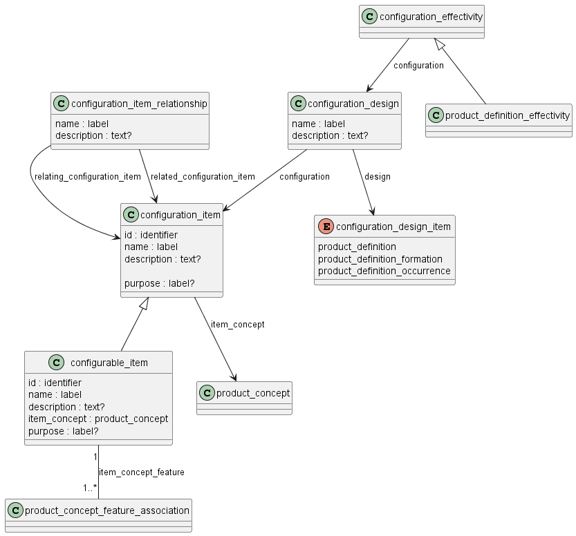

Схема configuration_management_schema на языке Express для идентификации и описания свойств изделия приведена в ГОСТ Р ИСО 10303-44-2022. Ниже приводится описание применения данной схемы для идентификаций конфигурации изделий машиностроения и их СЧ, разрабатываемых в соответствии со стандартами СПЖЦ и ЕСКД.

Схема configuration_management_schema из ISO 10303-44 нужна для описания и отслеживания того, из каких частей и вариантов состоит изделие, какие изменения в нем происходят, и кто эти изменения контролирует.

Главная цель — помочь вести учет состава любых сложных изделий на протяжении жизненного цикла: от разработки до эксплуатации. Это позволяет точно знать, какой вариант какого узла входит в изделие, кто его одобрил и почему что-то изменили. Схема используется для цифрового согласования комплектации при производстве, сервисе и модернизации.

Функциональность управления конфигурацией реализуется с помощью сущностей configuration_item, configuration_design и configuration_effectivity.

configuration_item - это объект конфигурации, который подлежит управлению.

**объект конфигурации**; ОКнф: Составная часть изделия, значимая для
выполнения установленных требований и рассматриваемая в процедурах
управления конфигурацией как единое целое [ГОСТ Р 59193-2020]

П р и м е ч а н и я

1 Объектом конфигурации на разных стадиях (этапах) жизненного цикла может быть финальное изделие в целом и составная часть изделия (система, агрегат, узел, деталь, программа для ЭВМ, в т. ч. встроенное программное обеспечение), документ (информационный набор, база данных и т.п.), интерфейс, материал, объекты, связанные с процессами жизненного цикла (стенд, оснастка, средство технического обслуживания и ремонта, инфраструктура, средство обеспечения производства и эксплуатации, система обучения, система сопровождения программных средств и т. п.).

2 Экземпляр изделия, являющегося ОКнф, как правило, получает уникальный идентификатор (индивидуальный или групповой), позволяющий отслеживать его характеристики в ходе жизненного цикла.

Объекты конфигурации могут быть выделены в составе концепций изделия (product_concept).

configuration_item_relationship — описывает, как объекты конфигурации связаны между собой, например, какие конкретные узлы входят в сборку.

configuration_design — определяет описание изделия в контексте (product_definition) или версии изделия (product_definition_formation), реализующих объект конфигурации.

Связь подходящих версий изделий для построения объекта конфигурации устанавливается с использованием объекта configuration_effectivity.

Три способа реализации configuration_effectivity:

- serial_numbered_effectivity, где configuration_effectivity основана на серийных номерах изготовленных изделий;

- date_effectivity, где configuration_effectivity основана на датах изготовления изделий;

- lot_effectivity, где configuration_effectivity основана на экземплярах партий изготовленных изделий.

ПРИМЕЧАНИЕ 1. Определения serial_numbered_effectivity, dates_effectivity и lot_effectivity приведены в ГОСТ Р 77.302

