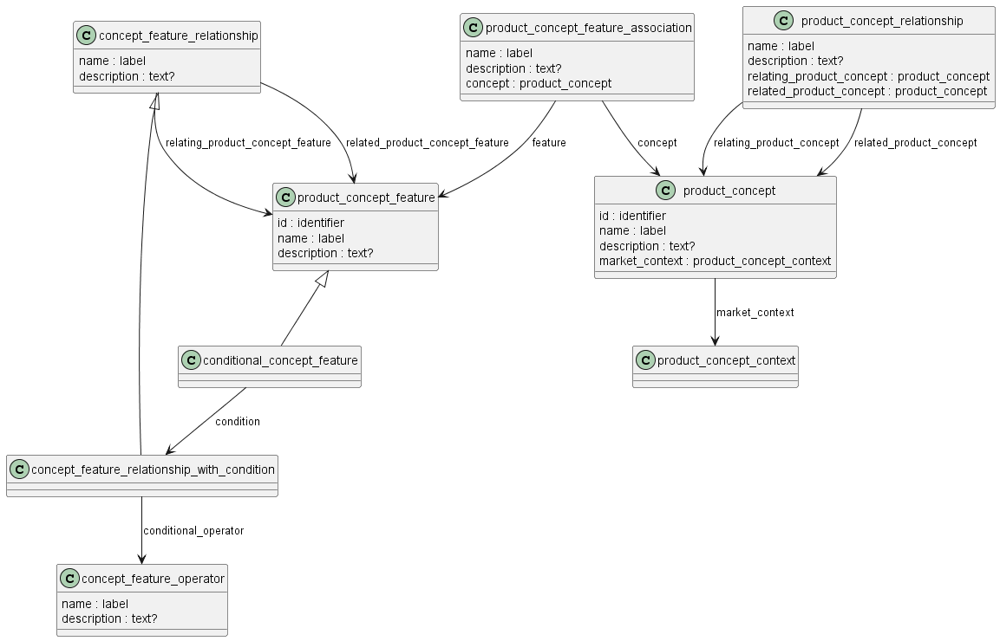

Схема product_concept_schema на языке Express для идентификации и описания свойств изделия приведена в ГОСТ Р ИСО 10303-44-2022. Ниже приводится описание применения данной схемы для идентификаций конфигурации изделий машиностроения и их СЧ, разрабатываемых в соответствии со стандартами СПЖЦ и ЕСКД.

**концепция изделия:** *определение (откуда взять?)*

Предметом схемы product_concept_schema является идея продукта, определяемая потребностями клиента (заказчика), т.е. концепция продукта. 

Концепция продукта формируется до того, как продукт будет описан и идентифицирован (определен). 

Концепция продукта определяет набор независимых характеристик или возможностей продукта. 

Концепция продукта также может содержать функции, определенные специально для нее. 

Для этих характеристик, возможностей и функций могут быть заданы взаимосвязи и условия, определяющие допустимые сочетания и возможные варианты продукта (в рамках одной концепции продукта). 

ПРИМЕР: Автомобиль может иметь два типа двигателей, которые могут быть идентифицированы как характеристики продукта. Один из них - двигатель малой мощности, другой - двигатель большой мощности. Система кондиционирования воздуха также может быть идентифицирована как характеристика продукта для того же автомобиля. Можно было бы оговорить условие, что при наличии кондиционера необходим двигатель большей мощности.

Применяются следующие концепции и допущения:

- Концепция продукта определяет конечный продукт, определенный производителем (разработчиком) для удовлетворения потребностей потребителя.
   
- Концепция продукта часто используется для определения набора характеристик или возможностей продукта. 
  
- Концепция продукта может включать несколько объектов конфигурации. 
  
- Концепция продукта может существовать без продукта или версии продукта. 
  
- Концепция продукта может содержать определенные характеристики продукта, определенные производителем для удовлетворения точки зрения потребителя. 
  
- Может быть определен набор правил для требуемых взаимозависимых комбинаций характеристик продукта. 
  
ПРИМЕЧАНИЕ. Примеры и диаграммы того, как объекты этой части стандарта ISO 10303 могут использоваться для представления комбинаций характеристик продукта, приведены в приложении E.

## Приложение E.2 Характеристики продукта и концепции продукта

Концепция продукта может допускать несколько допустимых вариаций продукта на основе зависимостей и условий, указанных для различных характеристик, которые для неё определены. В настоящем приложении приведены примеры различных типов зависимостей между характеристиками продукта с использованием настоящего стандарта ISO 10303 для представления этих зависимостей.

Конкретная модель автомобиля, выпускаемая автомобильной компанией, представлена ​​как product_concept. Модель выпускается с дизельным двигателем (DE) или двигателем с искровым зажиганием (SI). Каждый из них представлен экземплярами product_concept_feature. Глобальное условие «DE XOR SI» может быть сформулировано для обеспечения того, чтобы в каждом выпускаемом автомобиле был ровно один такой двигатель. Это условие представлено как conditional_concept_feature, ссылающийся на concept_feature_relationship_with_condition, где условный_оператор является concept_feature_operator с именем «XOR». В свойстве concept_feature_relationship_with_condition содержится ссылка на product_concept_feature с идентификатором "DE" как related_product_concept_feature и на product_concept_feature с идентификатором "SI" как related_product_concept_feature.

Среди характеристик конкретной модели автомобиля могут быть система кондиционирования воздуха (AC) и электрические стеклоподъемники (EW). Однако при заказе обеих этих характеристик также требуется более ёмкая батарея (SB). Каждая из этих характеристик автомобиля представлена ​​экземплярами product_concept_feature. Условие, согласно которому требуется более ёмкая батарея при заказе кондиционера и электрических стеклоподъемников, представлено экземплярами conditional_concept_feature. Для представления этого условия можно определить различные логические конструкции с использованием concept_feature_operator.

На рисунке E.13 показан один из способов представления этого условия с использованием бинарных операторов AND, OR и NOT. Логическое выражение будет выглядеть так: "(((AC AND EW) AND SB) OR (NOT (AC AND EW)))". Связь_концепции_характеристик_с_условием, где оператор_концепции_характеристик имеет имя "AND", устанавливает взаимосвязь, согласно которой запрашиваются как система кондиционирования воздуха, так и электрические стеклоподъемники. Эта взаимосвязь является условием для условной_концепции_характеристики. conditional_concept_feature связана с более мощной батареей оператором "AND", что означает наличие всех трёх характеристик. conditional_concept_feature также используется в связи с самой собой, по соглашению, для установки условия отрицания. Результирующие conditional_concept_feature связаны оператором "OR", что означает наличие либо всех трёх характеристик, либо и системы кондиционирования воздуха, и электрических стеклоподъемников.