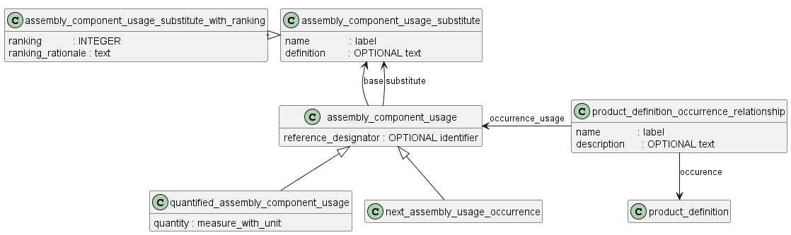

## Основная структура сборочной единицы (на 1 уровень)
### 1 Общие сведения
Объект **assembly_component_usage** имеет атрибут "reference_designator", в который может быть записан идентификатор конкретного вхождения одного изделия (1 шт.) в другое изделие. Такой идентификатор часто используется на схемах и ...

Возможны два способа указания количества, в котором СЧ входит в родительское изделие (один уровень вверх):
- описание каждого отдельного вхождения СЧ отдельным экземпляром объекта **next_assembly_usage_occurrence** (т. е. создание стольких экземпляров объекта, сколько штук конкретной СЧ входит в изделие);
- использование комплексного объекта **next_assembly_usage_occurrence + quantified_assembly_component_usage** и в дополнительном атрибуте «quantity» указание количества (с учетом применяемой единицы измерения), СЧ, входящих в родительское изделие.

Первый способ не может применяться для описания вхождений материалов и других изделий, количество которых измеряется не в штуках.

Объект **assembly_component_usage** имеет несколько подтипов для описания разных ситуаций

### 2 Описание допустимых замен

Если вместо одной СЧ в составе изделия может использоваться другая СЧ (допустимая замена), то все такие СЧ включают в состав изделия как отдельные вхождения, после чего информацию о допустимой замене приводят с использованием объекта **assembly_component_usage_substitute** (допустимая замена).

Данный объект позволяет установить связь между основным и заменяющим вхождениями в контексте конкретного изделия (сборочной единицы, комплекса, комплекта).

Если необходимо указать несколько допустимых замен с разными приоритетами использования, то используют объект – **assembly_component_usage_substitute_with_ranking** (подтип объекта **assembly_component_usage_substitute**), который позволяет для допустимой замены указать ее приоритет в виде целого числа.

Если вариант изготовления изделия представляет собой замену одной СЧ несколькими СЧ, то информацию о такой замене приводят с использованием  объекта **assembly_component_usage_substitute_with_ranking**, в котором все заменяющие детали помечают одним числом в атрибуте «ranking», а в атрибуте «ranking_rationale» приводят соответствующие пояснения: «Применять с позициями … взамен позиции  ...».

### 3 Подбор СЧ

Если при сборке изделия для его регулировки, настройки, компенсации СЧ подбирают, то указание таких СЧ в составе изделия выполняют в зависимости от способа их подбора.

Если подбор производится одинаковыми СЧ (например, требуемая нагрузка пружины достигается установкой под нее одинаковых шайб), то в состав изделия СЧ включается с помощью комплексного объекта **next_assembly_usage_occurrence + quantified_assembly_component_usage** с указанием в атрибуте «quantity» наиболее вероятного количества таких СЧ, а в атрибуте «description» приводят соответствующую запись: «Подобрать необходимое количество …» (например, «Подобрать необходимое количество для обеспечения нагрузки пружины»).

Если подбор производится установкой одного из изделий, имеющих разные размеры и самостоятельные обозначения (например, величина зазора должна обеспечиваться установкой только одного установочного кольца), то в состав изделия включают все необходимые СЧ с использованием объекта **next_assembly_usage_occurrence**, у которого в атрибуте «description» приводят соответствующую запись «Подбор из группы СЧ». Все варианты СЧ, выбираемые подбором, связывают с одним из вариантов (условно выбранным в качестве наиболее вероятного) с использованием объекта **assembly_component_usage_substitute**. Наиболее вероятный вариант указывают в атрибуте «base» каждого объекта **assembly_component_usage_substitute**, а в атрибуте «definition» указывают «Подборные СЧ».

Если подбор производится установкой нескольких изделий с различными размерами, обозначениями и в различных количествах, то в состав изделия включают все необходимые СЧ с использованием комплексного объекта **next_assembly_usage_occurrence + quantified_assembly_component_usage** с указанием в атрибуте «quantity» наиболее вероятного количества каждой СЧ, а в атрибуте «description» приводят соответствующую запись: «Подобрать необходимое количество …». Все варианты СЧ, выбираемые подбором, связывают с одним из вариантов (условно выбранным в качестве наиболее вероятного) с использованием объекта **assembly_component_usage_substitute**. Наиболее вероятный вариант указывают в атрибуте «base» каждого объекта **assembly_component_usage_substitute**, а в атрибуте «definition» указывают «Подборные СЧ».

### 4 Указание зависимости между двумя СЧ одной сборочной единицы

Объект **product_definition_usage_relationship** подволяет установить связь между двумя объектами **product_definition_usage**, которые описывают две СЧ одной сборочной единицы.

the related and relating product_definition_usage shall have the same relating_product_definition.

Это можно использовать для ....

### 5 Уникальное описание одного из множества вхождений одного изделия в состав другого изделия

**product_definition_occurrence_relationship** - это связь между **product_definition** и **assembly_component_usage**.

Эта связь позволяет задать особое описание для конкретного вхождения изделия в состав другого изделия (2-го из 5-ти, например). Особое описание - это объект **product_definition**, на который ссылается атрибут "occurence" объекта **product_definition_occurrence_relationship**. А вхождение, для которого задаем описание - это объект **assembly_component_usage** , на который ссылается атрибут "occurence_usage" объекта **product_definition_occurrence_relationship**

ОБРАТИТЕ внимание, что идентификация конкретного экземпляра компонента в сборке может быть задана с помощью атрибута reference_designator объекта assembly_component_usage.

ПРИМЕР: Определена структура изделия для автомобиля, в которой экземпляры объекта **product_definition** определены для шасси и колеса. Затем создаются четыре экземпляра **assembly_component_usage** для представления четырех колес шасси, в которых reference_designator имеет значения ‘левое переднее’, ‘правое переднее’, ‘левое заднее’, ‘правое заднее’. Для представления конкретной информации о правом заднем колесе создается **product_definition** колеса, с которым может быть связана эта информация. Чтобы указать, что этот **product_definition** представляет колесо, которое подразумевается экземпляром assembly_component_usage со значением атрибута reference_designator ‘правая задняя часть’, создается **product_definition_occurrence_relationship**, чтобы связать **product_definition** с **assembly_component_usage**.