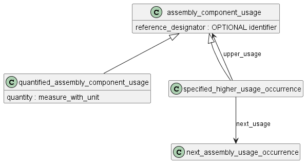

## Идентификация вхождений в полной структуре

Полная структура изделия формируется путем объединения всех основных структур всех сборочных единиц в составе изделия (рекурсивно вниз).

В такой полной структуре может потребоваться идентифицировать конкретные вхождения СЧ (например, чтобы различать датчик ДТ1 в левом и правом двигателе). Для этого используются конструкции описанные ниже.

### 1. Specified_higher_usage_occurence

**specified_higher_usage_occurrence** - это тип **assembly_component_usage**, который определяет связь между компонентом и сборкой, если сборка не является непосредственным родительским элементом для компонента.

Взаимосвязь между компонентом и сборкой, которую описывает объект **specified_higher_usage_occurrence**, задается в унаследованных от **product_definition_relationship** атрибутах relating_product_definition (сборка) и related_product_definition (компонент).

Два атрибута (upper_usage и next_usage) в первичном экземпляре объекта **specified_higher_usage_occurrence** должны соответственно указывать **assembly_component_usage** и **next_assembly_usage_occurrence**, которые вместе будут обеспечивать определение пути от компонента к сборке, для которой указывается **specified_higher_usage_occurrence**.

 Чтобы гарантировать, что **next_assembly_usage_occurrence** и **assembly_component_usage** вместе составляют полный путь, требуемый для **specified_higher_usage_occurrence**, требуется, чтобы экземпляр атрибута related_product_definition объекта **assembly_component_usage** был таким же, как и экземпляр атрибута related_product_definition объекта **next_assembly_usage_occurrence**. 
 
 Атрибут related_product_definition объекта **next_assembly_usage_occurrence** должен ссылаться на тот же экземпляр, что и атрибут related_product_definition для указанного объекта **specified_higher_usage_occurrence**. 
 
 Атрибут relating_product_definition объекта **assembly_component_usage** должен ссылаться на тот же экземпляр, что и атрибут relating_product_definition объекта **specified_higher_usage_occurrence**, который задается.

Если значение assembly_component_usage, на которое ссылается атрибут upper_usage, не является значением next_assembly_usage_occurrence, оно должно быть значением specified_higher_usage_occurrence. Это specified_higher_usage_occurrence должно иметь свои атрибуты upper_usage и next_usage, определенные, как описано в предыдущем абзаце, чтобы дополнительно указать путь к первичному specified_higher_usage_occurrence. Эта рекурсивная спецификация должна продолжаться до тех пор, пока атрибут upper_usage не будет ссылаться на объект assembly_component_usage, который является next_assembly_usage_occurrence. На этом этапе первичный параметр specified_higher_usage_occurrence полностью определен как с точки зрения его взаимосвязи компонентов/сборки, так и всего пути между ними.

ПРИМЕЧАНИЕ 1 Параметр specified_higher_usage_occurrence используется для определения частей списков деталей, которые содержат определенный элемент в сборке, для которого должны быть связаны определенные свойства, или когда этот элемент используется более чем в одной структуре сборки.

ПРИМЕЧАНИЕ 2 В приложении Е приведены примеры этого объекта и рисунки, показывающие взаимосвязи между ним и другими объектами этой схемы.(**Надо бы наделать похожих примеров и также их расписать здесь**)

### 2. multi_level_reference_designator

**multi_level_reference_designator** - это тип **assembly_component_usage**, который определяет связь между сборкой и компонентом, если сборка не является непосредственным родительским элементом для компонента, и между сборкой и компонентом существует несколько иерархических уровней. Иерархические уровни определяются списком **next_assembly_usage_occurrences**, который определяет связанный путь в структуре сборки.

Примечание - **multi_level_reference_designator** используется для идентификации конкретного экземпляра компонента в многоуровневой структуре сборки, с которым должны быть связаны определенные свойства.

Атрибуты:

- location: указывает упорядоченный список связанных событий **next_assembly_usage_occurrences**, который определяет однозначный путь от сборки к компоненту.
- root: указывает узел в структуре сборки, с которого начинается путь.
- leaf: указывает узел в структуре сборки, где заканчивается путь.

### 3. promissory_usage_occurence

Объект **promissory_usage_occurrence** позволяет сообщить, что компонент (**related_product_definition**) входит в сборку (**relating_product_definition**) независимо от количества промежуточных уровней между ними (т.е., вероятно, эта информация не нужна - когда это может быть?).

Примечание - **promissory_usage_occurrence** используется, когда структура продукта не определена полностью. В такой ситуации все еще возможно связать сборку с компонентом, чтобы зафиксировать намерение, с которым компонент будет использоваться в этой сборке.