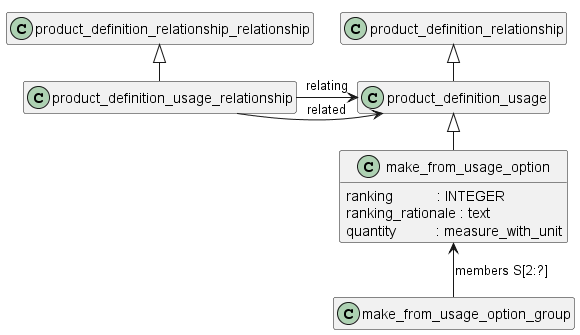

##  Изготовления детали из полуфабриката (заготовки)

### 1 Изготовление из заготовки
Задание требований к материалам и заготовкам основывается на общем механизме установления связей между описаниями изделий (версий) в конкретном контексте (см. А.2.8). При этом необходимый материал или заготовка также должны быть описаны как отдельное изделие (версия изделия) и иметь описание в конструкторском контексте.

Указание материала (заготовки), из которого должно быть изготовлено изделие, производится с использованием объекта **make_from_usage_option**, который наследует все атрибуты объекта **product_definition_relationship**

Если необходимо указать допустимые замены материала (заготовки), то каждый материал (заготовку) указывают с использованием отдельного экземпляра объекта **make_from_usage_option** и при необходимости указывают приоритет выбора материала в атрибутах «ranking» и «ranking rationale». Если все указанные материалы имеют одинаковый приоритет, то для всех экземпляров объекта указывают значение «1».

Для материала (заготовки) указывают потребное для изготовления количество (атрибут «quantity»), выраженное в необходимых единицах измерения.
Если необходимое количество материала не может быть объективно определено конструкторском (устанавливается технологом), то в атрибут «quantity» объекта **make_from_usage_option** записывают наиболее вероятное количество материала, а в атрибут «description» – следующую запись: «Указано приблизительное количество материала. Точное количество определяется технологом».

### 2 Изготовление детали путем доработки другого изделия (полуфабриката)

При использовании в качестве заготовки для изделия сборочной единицы саму заготовку связывают с изделием как материал с использованием объекта **make_from_usage_option**, а все изделия, устанавливаемые при дополнительной обработке или доделке, включают в состав изделия с использованием объекта **next_assembly_usage_occurrence**. 
В этом случае в технических требованиях (чертежа, электронной модели) допускается указывать, какие сборочные единицы и детали при переделке заменяют вновь установленными или исключают без замены, например: «Детали поз. 4 и 6 установить взамен имеющихся валика и втулки», «Имеющуюся втулку снять» и т. п. 

Если доработка заключается в дополнительной обработке заготовки без снятия, замены или установки новых СЧ, то в ЭСК такую информацию не приводят (все необходимые указания по доработке приводят на сборочном чертеже (в электронной модели) и в его технических требованиях).

### 3 Изготовление нескольких изделий из одной заготовки
**make_from_usage_option_group** - это коллекция экземпляров **make_from_usage_option**, которая определяет одну возможную комбинацию **product_definitions**, которая может быть создана из другого отдельного **product_definition**.

ПРИМЕЧАНИЕ 1 Группа **make_from_usage_option_group** используется для указания того, что из одного изделия может быть изготовлено несколько разных изделий.

Чтобы представить ограничение на одно изделие в рамках одной группы **make_from_usage_option_group**, **related_product_definition** для всех экземпляров **make_from_usage_options** должно быть одинаковым.

ПРИМЕР 1 Предположим, что заготовка бруска, представленная параметром **product_definition** D, может быть разрезана дважды, чтобы создать три - **product_definitions**, X, Y и Z. Группа **make_from_usage_option_group**, представляющая эту ситуацию, будет объединять три **make_from_usage_options**, как показано в таблице 1

ПРИМЕЧАНИЕ 2. Одно и то же изделие можно использовать для изготовления нескольких комбинаций других изделий.

ПРИМЕР 2. Один и тот же брусок с обозначением **product_definition** D можно разрезать для получения двух изделий **product_definition** X и одного изделия  **product_definition** T. В этом случае соответствующая группа **make_from_usage_option_group** объединит две группы **make_from_usage_options**, как показано в таблице 2.

ПРИМЕЧАНИЕ 3. Один экземпляр **make_from_usage_option** может быть частью нескольких групп **make_from_usage_option_groups**.