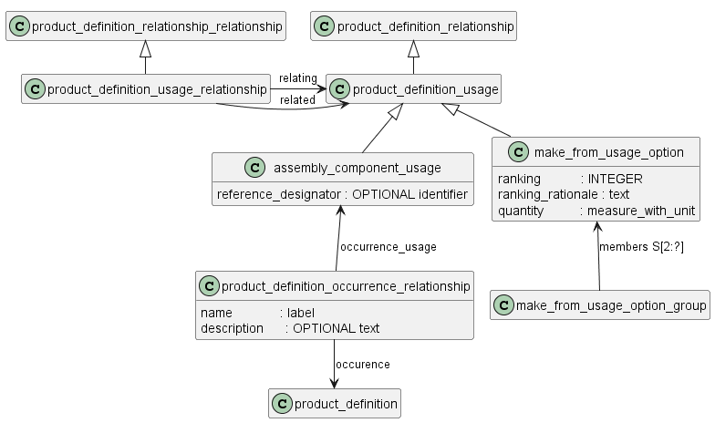
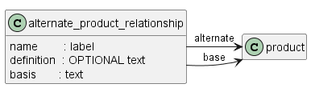
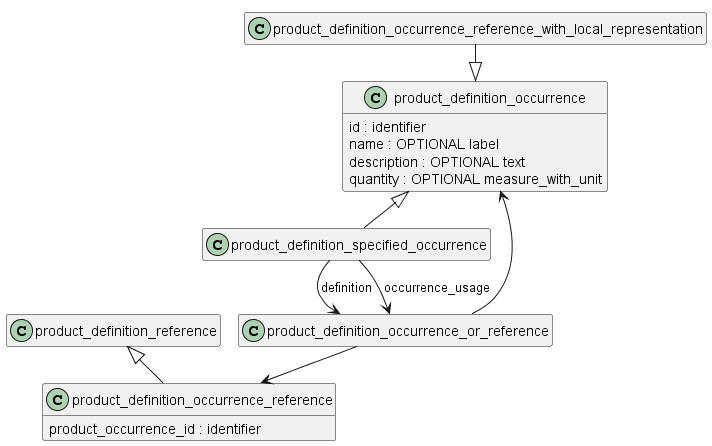

# Описание структуры изделия

Модель данных предназначена для описания получения одного изделия из другого изделия или изделий (в т.ч. полуфабриката, заготовки)

Модель данных позволяет описать:
- конструкторскую или технологическую структуру изделия - сборочной единицы.
- изготовления детали из полуфабриката (заготовки)

Вхождение одного изделия в другое или изготовление одного изделия из другого описывается путем создания связи между объектами **product_definition** (самой сборочной единицы и ее СЧ,  самой детали и полуфабриката и т.п.). 

Эти связи могут быть разных видов, но все наследуются от объекта **product_definition_relationship** (описан в разделе "общие сведения об изделии")

Структура сборочной единицы - это совокупность связей всех СЧ (в т.ч. материалов в сборке) с этой сборочной единицей. Для описания каждой связи (вхождения) используется стандартный объект **assembly_component_usage_occurrence** (вхождение в сборочную единицу).

Информация об изготовлении детали из заготовки/полуфабриката описывается объектом **make_from_usage_option** (изготовлено из).

Перечисленные объекты наследуют все атрибуты объекта **assembly_component_usage** (вхождение), который, в свою очередь, наследует атрибуты от **product_definition_relationship** 

## Аналоги

**alternate_product_relationship** - это связь между двумя изделиями, при которой одно изделие (аналог) может использоваться вместо другого изделия (базового).

Если одно изделие является аналогом для другого изделия, то понятно, что нет никакого интереса отслеживать, какое изделие, базовое или любые указанные аналоги, используется в качестве конкретного экземпляра базового изделия в структуре изделия.

ПРИМЕЧАНИЕ. Организация может отслеживать изменения в конструкции базовой детали и устанавливать условия эффективности использования этой базовой детали в различных производимых сборках. Использование аналога подразумевает, что организация не определяет какую-либо конкретную версию аналога и не устанавливает связанные с ней параметры эффективности.

Отношение **alternate_product_relationship**, для которого базовым продуктом является сборка, указывает, что вся структура продукта аналога может использоваться вместо базового изделия и его структуры.

ПРИМЕР 1. Два болта одинакового размера являются изделиями. Один болт имеет квадратную головку, а другой - шестигранную. Эти формы головок являются свойствами соответствующих изделий. Эти два болта считаются эквивалентными с точки зрения формы, установки и функциональности: оба они имеют достаточно близкую физическую форму, занимают одинаковое пространство при использовании и служат для скрепления двух предметов друг с другом. Таким образом, один из этих двух болтов можно рассматривать как аналог другого болта.

Связь, установленная объектом **alternate_product_relationship**, не обязательно должна быть симметричной. Если B является аналогом для A, то A не обязательно является аналогом для B.

## концепция "вхождения" (возможно это не нужно, не поняла пока)

**product_definition_occurrence** - это идентифицированное появление **product_definition** или **generic_product_definition_reference** или другого **product_definition_occurrence** в одной или нескольких структурах продуктов.

НАПРИМЕР, структуры продукта, в которых идентифицируется **product_definition_occurrence**, могут быть разными видами ЭСИ (функцинальной, логистической, зональной и т.п.) и сборками.

## Описание структуры сборочной единицы 
См assembly_structure.md

## Информация об изготовлении детали из заготовки/полуфабриката
См make_from.md

