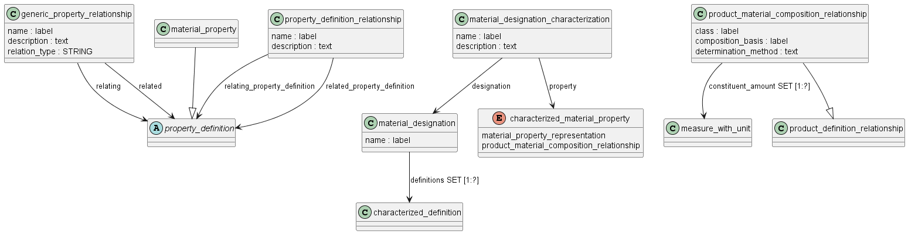

Схема material_property_definition на языке Express приведена в ГОСТ Р ИСО 10303-45-2022. Ниже приводится описание применения данной схемы для идентификаций материала для изделий машиностроения и их СЧ, разрабатываемых в соответствии со стандартами СПЖЦ и ЕСКД.

Схема material_property_definition_schema описывает, как представить технические характеристики материалов изделий и их состав. Она включает набор объектов, которые помогают структурно и однозначно задавать свойства материалов, их состав и связь с изделиями.

Основные объекты и их назначение:

- **material_designation** - определяет название или обозначение материала, связанного с изделием или его частью. Например, "Сталь 40Х" или "Пластик ABS". Это позволяет указать, какой именно материал используется.

- **material_designation_characterization** - это описание конкретных характеристик материала с привязкой к его обозначению. Например, для стали 40Х могут быть определены предел прочности, твердость и плотность. Этот объект связывает свойства с названием материала.

- **material_property** - основной объект для определения технических свойств материала, например, плотность, прочность, теплопроводность. Это подтип общего property_definition, но свойство обязательно должно иметь условия достоверности (например, температура испытания, метод измерения).

- **product_material_composition_relationship** - объект, который связывает состав материала с изделием. Например, указывает, что изделие состоит из определённых материалов или сплавов, их количество и взаимное расположение. Это важно для описания сложных составных материалов.

- **property_definition_relationship** - объект для описания взаимосвязей между различными свойствами, например, когда одно свойство вычисляется через другое.

- **material_property_representation** - описывает, как свойства материала представлены (числовое значение, таблица, зависимость). Обязательным атрибутом является окружение (контекст) данных (data_environment) — набор условий, при которых свойство действительно.

- **data_environment** - группа условий, описывающих параметры испытаний, среды или другие факторы, влияющие на свойства (температура, давление, влажность и т.д.). Связывается с представлением свойства.

Как использовать (пример):

Берём материал «Сталь 40Х» — определяем его с помощью объекта material_designation. Далее для него создаём material_designation_characterization, где привязываем свойства (material_property), например:

- предел прочности 800 МПа при температуре 20 °C (условие и метод испытания это data_environment и material_property_representation);

- твердость 28–32 HRC;

- плотность 7,85 г/см³.

Связь material_property с изделием или его частью реализуется через product_material_composition_relationship.

Для чего нужно:

Это позволяет системам обмениваться едиными, формальными и полными данными о материалах и их характеристиках, включая условия измерений и методы, чтобы избежать неоднозначностей. Такая информация важна для конструкторов, технологов, инженеров и поставщиков во всех этапах жизненного цикла изделия.

Таким образом, материал_property_definition_schema — это «каркас» для полного, точного и согласованного описания материалов и их свойств, обеспечивая стандартизацию описания технических характеристик изделий в цифровом обмене.

Основные понятия и допущения:

- свойства материала являются репрезентативными для всех технических свойств, которые определяются с помощью определенного метода тестирования;
- технические свойства (engineering property) характеризуют некоторые аспекты поведения изделия;
- состав изделия (матриала?) описывается спецификацией типа, количества и расположения его компонентов (type, amounts and arrangement of its constituents).

Технические свойства могут быть определены на основе измерений на изделии в целом, на образце, взятом из изделия каким-либо способом, например, путем резки, или на совершенно отдельном образце для испытаний, полученном путем обработки таким же образом, как и само изделие. Применение результатов, полученных на испытательном образце, ко всему изделию зависит от отношения образца к изделию, поскольку в результате производственного процесса изделие может быть неоднородным или изотропным.

На значения большинства свойств изделия влияет производственный процесс. Производственный процесс может влиять на тип и количество элементов, из которых состоит изделие, а также на их форму и расположение. Этими элементами могут быть атомы, молекулы или другие их агрегаты в виде отдельных форм, таких как кристаллы, волокна или объемы полукристаллических или стеклообразных материалов. Расположение элементов определяет структуру материала изделия.

Структура материала твердого изделия может быть как однородной, так и неоднородной, или представлять собой смесь твердых веществ, например, в композитных конструкциях. Полное описание конструкции включает в себя соотношение любых предпочтительно выровненных элементов конструкции друг с другом и с изделием.

Значения технических характеристик также могут быть присвоены продукту путем ссылки на спецификацию, из расчета или предположения.

**ПРИМЕР 1** Производитель может изготовить продукт в соответствии со спецификацией и вместо того, чтобы сообщать о фактических измерениях в конкретной партии продукта, он может сообщить номинальное значение, указанное в спецификации.

**ПРИМЕР 2** Химик может выполнить расчеты, используя предполагаемые значения прочности соединения, чтобы предсказать прочность полимера, который никогда не синтезировался.

**ПРИМЕР 3** Инженер, проводящий конечно-элементный анализ детали, может присвоить значения свойств, чтобы предсказать потенциальные характеристики продукта в зависимости от свойств.

=====================================================================

