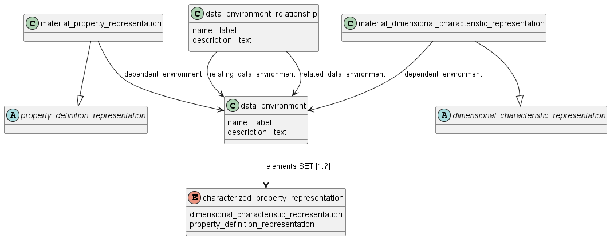

Схема material_property_representation на языке Express приведена в ГОСТ Р ИСО 10303-45-2022. Ниже приводится описание применения данной схемы для идентификаций материала для изделий машиностроения и их СЧ, разрабатываемых в соответствии со стандартами СПЖЦ и ЕСКД.

Схема material_property_representation_schema из ISO 10303-45 предназначена для структурированного представления свойств материалов(например, механических, химических, физических) и условий их действия (обеспечения, измерения, например, температура испытаний, влажность, способ получения образца) в контексте автоматизации производства и обмена инженерными данными. Эта схема помогает формализовать данные о технических характеристиках материалов, условиях проведения испытаний и способах их фиксации, что важно для поддержки цифровых процессов во всем жизненном цикле изделия.

Среди ключевых объектов схемы выделяются:

**material_property_representation** — представление свойства материала. Это подтип объекта property_definition_representation, описанного в ГОСТ Р 77.4ХХ, который позволяет к представлению свойства добавить ссылку на условия (data_environment), при которых данное представлление актуально.

**data_environment** — набор условий (атрибутов), которые однозначно определяют валидность представления свойства; может содержать описание среды, текстовые пояснения, перечень элементарных условий.

Каждое условие в наборе описывается с использованием объекта property_definition_representation или объекта dimensional_charecteristic_representation

**data_environment_relationship** — связь между двумя объектами data_environment, используется для установки логических или содержательных связей между разными наборами условий.

Связи между сущностями
material_property_representation зависит от объекта data_environment — описание свойства материала корректно только при выполнении определённых условий (например, для стали прочность будет зависеть от температуры испытания).

data_environment_relationship позволяет устраивать отношения между условиями: например, «при температуре 20°C и влажности 50%» — это отдельный data_environment, который может быть связан с другим environment для иных условий эксплуатации.

Через наследование и ссылки на внешние схемы, объекты связываются с более широкой структурой STEP: свойство материала — с продуктом, условия — с методами испытаний, единицы измерения — с qualified_measure_schema.

Примеры применения
В PLM-системе для цифрового двойника изделия схема используется для хранения сведений о сертификационных испытаниях материалов, с фиксацией условий и методов, при которых получены значения прочности, вязкости или плотности.

В машиностроении: описание свойств сплава (например, предел текучести при +25°C) для передачи спецификаций между заводом-изготовителем и потребителем.

В строительстве: аттестация материалов при различных климатических режимах, при необходимости — с отсылкой к лабораторным протоколам.

Эти механизмы обеспечивают точность, интероперабельность и прослеживаемость инженерных данных при использовании их для анализа, расчетов и сертификации изделий.

Основные понятия и допущения:

- возможно множественное представление объекта, включая использование числовых значений, параметрических или фундаментальных уравнений, графических представлений и нечисловых значений;

ПРИМЕЧАНИЕ. Различие между понятием и представлением понятия описано в стандарте ISO 10303-43

- значение свойства может быть присвоено или измерено;
- 
- если значение измеряется, то полученное значение будет зависеть от метода измерения и условий, используемых при применении метода;
- 
- если значение присвоено, могут быть указаны условия, при которых это присвоение является действительным;
- 
- в случае присвоения или измерения условия, при которых значение является действительным, выражаются в виде набора количественных и качественных данных, которые формируют среду данных.

**НАПРИМЕР**, условия окружающей среды для измерения могут быть выражены как "воздух в помещении" (качественное состояние) или воздух 20 градусов Цельсия и давление в 1 атмосферу.

Условия метода измерения могут поддерживаться постоянными на протяжении всего измерения. В качестве альтернативы, некоторые условия могут изменяться независимо от других условий для получения набора связанных свойств.

Не все значения свойств должны быть выражены количественно, т.е. числовыми значениями. Значения также могут быть выражены качественно, т.е. с помощью описания.

**НАПРИМЕР**, цвет, поддающийся количественному выражению, в основном описывается качественно такими словами, как "красный", "эгейский синий", "серый металлик" и т.д.

