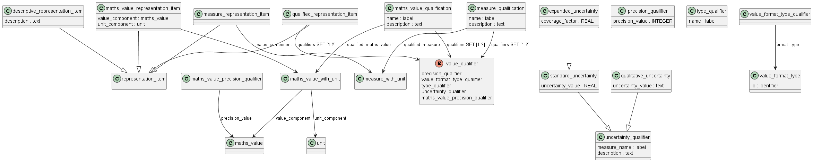

Схема qualified_measure_schema из ISO 10303-45 предназначена для описания количественных характеристик с дополнительными атрибутами, позволяющими уточнить тип, точность, степень неопределенности и доверенности измеряемых или вычисляемых величин.

Основная задача схемы — дополнить представление физических величин атрибутами, которые позволяют явно указывать тип значения (измеренное, номинальное, максимальное и т.д.), количество значащих цифр, диапазон неопределенности и способ квалификации. Это критично для корректного обмена инженерными данными, включая спецификации, результаты испытаний и расчетные параметры материалов в PLM, CAD и других информационных системах.

Среди ключевых объектов схемы выделяются:

qualified_representation_item — объект с набором квалификаторов, уточняющих характеристику значения.

measure_qualification — обеспечивает связь между конкретным измерением (measure_with_unit) и набором квалификаторов; позволяет дополнять физическую величину деталями о типе, точности и неопределенности.

value_qualifier — элемент квалификации значения, тип — SELECT из трех вариантов: precision_qualifier, type_qualifier, uncertainty_qualifier.

type_qualifier — указывает тип значения (например, "measured", "nominal", "maximum", "design allowable" и другие).

precision_qualifier — задаёт количество значащих цифр при представлении значения.

uncertainty_qualifier — характеризует область неопределенности (например, стандартная, качественная, интервальная) и способы её расчета.

Связи между сущностями
qualified_representation_item содержит набор квалификаторов, которые в свою очередь могут быть instances типа precision_qualifier (не более одной), type_qualifier и uncertainty_qualifier.

measure_qualification связывает объект measure_with_unit с одним или несколькими квалификаторами value_qualifier, описывая дополнительно точность, тип значений и область неопределенности.

uncertainty_qualifier может быть связан с качественной или стандартной неопределенностью, уточняя свойства измерения и область допустимых значений.

Примеры применения
Описание характеристик материала в форме: предел прочности (measured), представленное с точностью до 2 знаков, с интервальной неопределённостью, указывающей диапазон достоверности в 95%.

Представление расчетных параметров в симуляции: номинальное расчетное давление с указанием типа ("calculated") и стандартной неопределенности по ISO, что важно для сравнения и сертификации.

Передача спецификаций в машиностроении: масса компонента описана квалификаторами "measured", "maximum" и точностью (число знаков), что помогает унифицировать сравнение запчастей между производителями.

Все эти механизмы обеспечивают единообразное, формализованное описание количественных характеристик, необходимых для инженерного обмена, расчетного анализа и документирования производственных данных.

qualified_measure_schema переопределяет ресурсные конструкции из measure_schema и maths_function_schema, чтобы можно было квалифицировать величины, т.е. дополнительно охарактеризовать их тип, точность, неопределенность и надежность. qualified_measure_schema предоставляет определенный синтаксис для указания разрешенных форматов для числовых значений, которые могут быть связаны со свойством.

Физическая величина может иметь несколько аспектов, отличных от ее значения и единиц измерения. Значение может быть неопределенным из-за вариативности процедуры измерения, что приводит к недостаточной воспроизводимости. Например, значение элемента данных может быть помечено как одобренное для проектирования или иным образом охарактеризовано в отношении его типа и статуса. Эта схема поддерживает добавление этих понятий.

Концепция неопределенности измеряемой величины, используемая в этой части стандарта ISO 10303, взята из пункта 2.2 Руководства ISO/IEC 98:1995. В общем, результат измерения, y, является лишь приблизительным или оценочным значением конкретной величины, которая является объектом измерения (измеряемой величиной), Y. Неопределенность результата измерения отражает отсутствие точных знаний об измеряемой величине, и, таким образом, результат является полным только в том случае, если это сопровождается количественным указанием на его неопределенность. Неопределенность, как правило, состоит из нескольких компонентов, которые могут быть сгруппированы в две категории в соответствии с методом, используемым для оценки числовых значений компонентов:

- те, которые оцениваются статистическими методами;
- те, которые оцениваются другими способами.

Каждый компонент неопределенности, который вносит свой вклад в неопределенность результата измерения, представлен расчетным стандартным отклонением, называемым стандартной *неопределенностью*, ui, и равным положительному квадратному корню из расчетной дисперсии. Процедуры оценки стандартной неопределенности для обеих вышеуказанных категорий описаны в пункте 4 Руководства ИСО/МЭК 98:1995.

Стандартная неопределенность результатов измерения, когда этот результат получается из значений ряда других величин, называется комбинированной стандартной неопределенностью, uc. Это расчетное стандартное отклонение, связанное с результатом, и оно равно положительному квадратному корню из совокупной дисперсии, полученной путем суммирования всех компонентов дисперсии и ковариации, независимо от их оценки. Процедура объединения компонентов дисперсии и ковариации описана в пункте 5 Руководства ISO/IEC 98:1995. Эта схема предоставляет средства для представления либо стандартной неопределенности, либо комбинированной стандартной неопределенности.

ПРИМЕЧАНИЕ. Количество измерений, которые были использованы для определения неопределенности измеряемой величины, может быть указано с помощью параметра data_environment, связанного со значением (см. раздел 5).

Хотя комбинированная стандартная неопределенность используется для выражения неопределенности многих результатов измерений, часто требуется мера неопределенности, определяющая интервал относительно результата измерения, в пределах которого можно с уверенностью утверждать, что значение измеряемой величины находится в пределах нормы. Мера неопределенности, предназначенная для удовлетворения этого требования, называется расширенной неопределенностью U и получается путем умножения uc(y) на коэффициент охвата k. Таким образом, U = kuc(y) и можно с уверенностью утверждать, что: y – U <=Y <= y + U, что обычно записывается как Y = y ± U. Как правило, значение k выбирается на основе желаемого уровня достоверности, который должен быть связан с интервалом, определяемым U = kuc . Обычно значение k находится в диапазоне от 2 до 3. Когда к результатам применяется нормальное распределение и uc имеет незначительную неопределенность, то k = 2 определяет интервал с уровнем достоверности приблизительно 95 процентов, а k = 3 определяет интервал с уровнем достоверности более 99 процентов.

