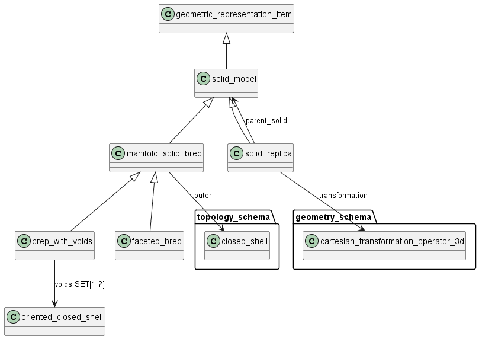
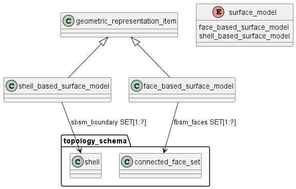
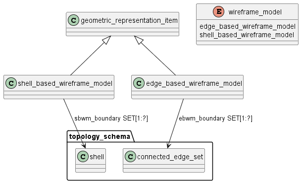

Схема geometric_model на языке Express приведена в ISO 10303-42:2024. Ниже приводится описание применения данной схемы для описания (передачи?) геометрической модели изделий, разрабатываемых в соответствии со стандартами СПЖЦ и ЕСКД.

Схема geometric_model_schema предназначена для описания формы, размеров и положения трехмерных объектов, чтобы их можно было однозначно и корректно передавать между различными CAD/CAM/PLM системами.

Схема позволяет передавать:

1) точные твердотельные модели;
2) поверхностные модели;
3) каркасные модели;
4) фасетные модели.
  
*Примечание - в 10303 еще геометрические наборы - не понятно, что это*

Примеры применения:

- Передача CAD моделей между разными системами: формализованное описание формы детали или сборки, чтобы в другой системе открыть чертеж без искажений.

- 3D-визуализация: хранение, рендеринг и анализ поверхностей, каркасных моделей или твердотельных тел на экране.

- Анализ и симуляция: использование для построения расчетных сеток (mesh generation), анализа прочности, аэродинамики, изготовления пресс-форм.

- 3D-печать и CAM: экспорт корректных геометрий (например, stl, step) для прямого запуска на оборудовании, где критично точное соответствие формы и размеров.

## Твердотельная геометрическая модель (solid_model)

ГОСТ Р 2.052, статья 3.1.14:	**твердотельная геометрическая модель:** Полное трехмерное представление номинальной формы изделия таким образом, что для любой точки пространства можно определить, находится ли точка внутри твердотельной модели, на границе твердотельной модели или вне твердотельной модели.

*Примечание – Твердотельная модель позволяет описать форму, вычислить объем, площадь поверхности и массу объекта (при наличии сведений о плотности материала).*

Определены два классических типа твердотельной модели: конструктивная твердотельная геометрия (CSG) и представление границ (B-rep). 

В ГОСТ Р 2.052 определены 2 метода представления геометрических данных:

- граничное представление геометрических данных (B-rep): Метод представления геометрических данных с помощью математически точного аналитического описания границ объекта моделирования.
  
- конструктивно-блочное представление геометрических данных (csg): Метод представления геометрических данных как результата выполнения последовательности упорядоченных логических операций с элементарными твердыми телами.

В данном стандарте рассматривается только первый метод.

Модели B-rep представлены набором оболочек (closed_shell), определяющих их внешние или внутренние границы. Ограничения обеспечивают, что четко определена соответствующая геометрия, и что выполняется формула Эйлера, связывающая количество вершин, ребер, граней, петель и оболочек в модели. 

Объект manifold_solid_brep является подтипом solid_model, который представляет собой конечный линейно связанный объем, ограниченный одной или несколькими поверхностями. Каждая поверхность является связным ориентированным конечным замкнутым 2-многообразием. Ограничения на количество сквозных отверстий или количество пустот в объеме отсутствуют. Граничное представление (B-rep) многообразия твердого тела использует граф ребер и вершин, вложенных в связную ориентированную конечную замкнутую поверхность 2-многообразия. Встроенный граф делит поверхность на линейно связанные области, известные как грани. Ребра и вершины образуют границы граней, область грани не включает ее границы. Вложенный граф может быть отвязан и быть псевдографом. Графы маркируются, т. е. каждый объект в графе имеет уникальный идентификатор. Определение геометрической поверхности для задания геометрии грани должно быть 2-многообразием, встраиваемым в плоскость внутри области грани. Данное 2-многообразие должно быть связным, ориентированным, конечным, не иметь самопересечений и иметь род поверхности, равный 0. Грани не пересекаются, за исключением их границ. Каждое ребро вдоль границы грани связано не более, чем с одной другой гранью. Набор ребер в представлении B-rep не пересекается, за исключением их границ (т. е. вершин). Определение геометрической кривой для задания геометрии ребра должно быть линейно связанным и не иметь самопересечений или перекрытий в пределах области ребра. Геометрия ребра должна соответствовать геометрии граней, частичную границу которой она образует. Геометрия вершины должна соответствовать геометрии граней и ребер, частичную границу которых она образует. Модель B-rep представляется одной или несколькими объектами closed_shell, которые не должны пересекаться. Одна внешняя оболочка должна полностью охватывать все остальные оболочки, и никакая другая оболочка не может охватывать внешнюю оболочку.

Объект faceted_brep является подтипом manifold_solid_brep, который представляет собой простую форму модели граничного представления, в которой все грани плоские, и все ребра – прямые.

*Примечание – Объект faceted_brep был введен для поддержки большого количества систем, которые допускают твердотельные представления граничного типа только с плоскими поверхностями. Фасетные модели могут быть представлены с помощью manifold_solid_brep, но их представление в виде faceted_brep будет более компактным.*

Объект solid_replica предоставляет механизм для копирования существующего твердого тела в новое местоположение. 

Solid_replica является подтипом solid_model, представляющим реплику другого твердого тела в новом положении.

Атрибут parent_solid содержит ссылку на исходную твердотельную модель, которая копируется для создания solid_replica. Атрибут transformation – содержит ссылку на объект cartesian_transformation_operator_3d, который определяет местоположение и ориентацию solid_replica, а также связанный коэффициент масштабирования.

## Поверхностная геометрическая модель

ГОСТ Р 2.052, статья 3.1.10	**поверхностная геометрическая модель:** Геометрическая модель, в которой форма объекта моделирования представлена в виде совокупности точек, кривых и ограниченных поверхностей.

*Примечания*

*1  Поверхностная модель объекта позволяет для любой точки пространства определить, принадлежит ли точка поверхности объекта.*

*2  Поверхностная модель позволяет описать форму и вычислить площадь поверхности объекта.*

Тип surface_model является списком дополнительных типов данных и предоставляет механизм для ссылки на экземпляр одного из этих типов данных.

Тип выбора surface_model собирает все возможные объекты модели поверхности.
Некоторые представления модели изделия состоят из наборов поверхностей, которые не обязательно образуют полную границу твердого тела. Такая модель может быть представлена набором объектов face или shell.

Объект shell_based_surface_model является подтипом geometric_representation_item, который описывается набором открытых или закрытых оболочек размерности 2. Оболочки не должны пересекаться, за исключением ребер и вершин. Различные грани не могут пересекаться. Полная грань одной оболочки может быть использована совместно с другой оболочкой. Совпадающие части оболочек должны ссылаться на одни и те же грани, ребра и вершины, определяющие совпадающую область. Должен быть хотя бы один объект shell. Объект shell может существовать независимо от shell_based_surface_model.

Объект face_based_surface_model является подтипом geometric_representation_item, который описывается набором connected_face_set размерности 2. Объект connected_face_set не должен иметь пересечений кроме ребер и вершин, за исключением того, что face в одном наборе связанных граней может перекрывать face в другом наборе связанных граней при условии, что границы граней идентичны. Должен быть хотя бы один connected_face_set. Объект connected_face_set может существовать независимо от face_based_surface_model.

## Каркасная геометрическая модель

Тип wireframe_model является списком дополнительных типов данных и предоставляет механизм для ссылки на экземпляр одного из этих типов данных.

Тип wireframe_model представляет все доступные объекты каркасной модели.
Каркасное представление геометрической модели содержит информацию только о пересечениях поверхностей, образующих границу, но не содержит информации о самих поверхностях.

Объект shell_based_wireframe_model является подтипом geometric_representation_item, который описывается графом ребер и вершин, встроенным в R 3. Граф может быть несвязанным. Внутри графа ребра пересекаются только на своих границах (т. е. вершинах). Геометрия, связанная с вершиной, должна соответствовать геометрии, связанной с любым из ребер, вершина которого образует границу. Объект shell_based_wireframe_model представлен одним или несколькими объектами shell размерности 0 или 1. Должен быть, по крайней мере, один объект shell. Объект shell может существовать независимо от объекта shell_based_wireframe_model.

Объект edge_based_wireframe_model является подтипом geometric_representation_item, который описывается графом ребер и вершин, встроенным в R 3. Граф может быть несвязанным. Внутри графа ребра пересекаются только на своих границах (т. е. вершинах). Геометрия, связанная с вершиной, должна соответствовать геометрии, связанной с любым из ребер, вершина которого образует границу. Объект edge_based_wireframe_model представляется одним или несколькими объектами connected_edge_set размерностью 1. Должен быть, по крайней мере, один объект connected_edge_set. Объект connected_edge_set может существовать независимо от объекта edge_based_wireframe_model.

## Фасетная геометрическая модель

ГОСТ Р 2.052, статья 3.1.15	**фасетное представление геометрических данных:** Метод представления геометрических данных в виде конечного числа аппроксимирующих многогранников.

Объект tessellated_item является подтипом geometric_representation_item, используемым для фасетного представления геометрии.

Элемент tessellated_item должен быть использован только в tessellated_shape_representation. Объект tessellated_shape_representation является подтипом shape_representation, в котором геометрия приблизительно представлена мозаичной моделью с плоскими фасетами. 

Объект tessellated_shape_presentation должен содержать по крайней мере один объект tessellated_item в наборе items.