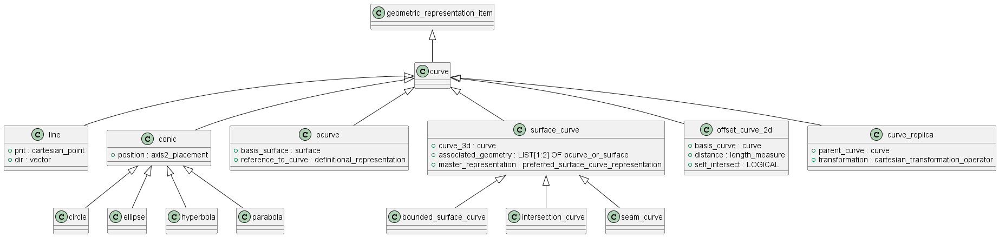

# Описание кривой

Кривая - это непрерывное отображение отрезка [t1, t2] в точки двумерного или трехмерного пространства. Диапазон [t1, t2] называется областью определения кривой. Значение радиус-вектора и производных кривой, вычисленных за пределами области определения в общем случае не определено.

Перечень классов: 
- line
- ellipse
- polyline
- rational_b_spline_curve
- trimmed_curve
- pcurve
- curve_replica

## Класс line

Бесконечная прямая линия, заданная точкой и вектором. Непосредственно в моделировании не используется, является основой для построения отрезка.
Радиус-вектор вычисляется по формуле:
r(t) = p0 + d * t,
область определения бесконечная.

## Класс ellipse

Эллипс, положение центра и направление осей которого задается в локальной системе координат. Используется в моделировании как непосредственно, так и как основа для построения других кривых.
Радиус-вектор вычисляется по формуле:
r(t) = C + A * cos(t) * x0 + B * sin(t) * y0,
область определения бесконечная.

## Класс polyline

Ломаная линия, соединяющая последовательно опорные точки. Является частным случаем интерполяционный кривой: радиус-вектор при целочисленных значениях параметра совпадает с опорными точками, при дробных лежит на отрезке между соседними точками:
r(t) = R[i-1] * t + R[i] * (1-t), где i-1 < t <=i.
Область определения [0,N-1], где N - количество опорных точек, нумерация начинается с нуля.