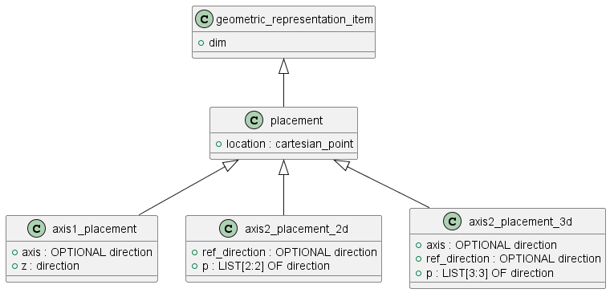

# Описание placement

Placement - это сущность, которая отвечает за расположение геоеметрического объекта в пространстве. Минимальная степень детализации расположения достигается посредством указания точки, размерность которой равна размерности пространства. Дальнейшая детализация достигается в потомках за счет указания осей.

Перечень классов: 

Перечень классов: 
- placement - это базовый класс для представлений расположения. Данный класс несет информацию только о преобразовании смещения.
- axis2_placement_2d - то представление расположения на плоскости, при котором задано начало координат ось OX.
- axis2_placement_3d - это представление расположения в пространстве, при котором задано начало координат и оси OZ и OX. 

## Класс placement

Определяется точкой, которая задает перемещение в плоскости или простарнстве.

## Класс axis2_placement_2d

Второй орт системы координат определяется как поворот заданного орта на четверть оборота против часовой стрелки.

## Класс axis2_placement_3d

Ось OY вычисляется как векторное произведение осей OX * OZ.