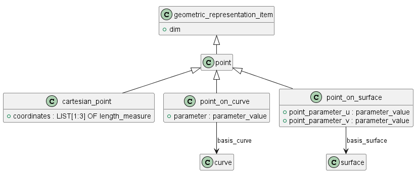

# Описание точки

Перечень классов: 
- point - это ...
- cartesian_point - это ...
- point_on_curve - это ...
- point_on_surface - это ...

## Класс cartesian_point
Это ... Используется для ...
Задается списком координат (coordinates) ...

## Класс cartesian_point
Это ... Используется для ...
Задается путем ссылки на кривую в атрибуте basis_curve и указания параметра (point_parameter) ...

## Класс point_on_surface
Это...
Задается ...