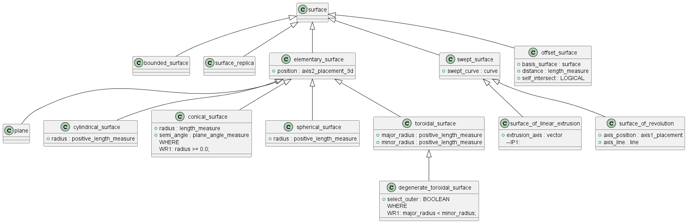

# Описание поверхности

Кривая - это непрерывное отображение связного множества в двумерном пространстве параметров (u,v) в точки трехмерного пространства. Отображаемое множество называется областью определения поверхности. Значение радиус-вектора и частных производных поверхности, вычисленных за пределами области определения в общем случае не определено.

Перечень классов
- elementary_surface
- plane_surface
- cylinder_surface
- cone_surface
- sphere_surface
- torus_surface
- ration_b_spline_surface
- curve_bounded_surface
- surface_replica

# Класс elementary_surface

Базовый класс для определения элементарных поврехностей. Содержит локальную систему координат, в которой задается элементарная поверхность.

\vec{c} - радиус-вектор начала системы координат.
\vec{OX}, \vec{OY}, \vec{OZ} - базисные векторы системы координат.

# Класс plane_surface

Плоскость. Область определения бесконечная по u и по v. 

Радиус-вектор вычисляется по формуле:

\vec{r}(u,v) = \vec{C} + \vec{OX} \cdot u + \vec{OY} \cdot v .

# Класс cylinder_surface

Цилиндрическая поверхность. Определяется значением радиуса R - числом с плавающей точкой больше нуля (ИЛИ МЕТРИЧЕСКОЙ ПОГРЕШНОСТИ).

Область определения по u от 0 до 2 \cdot \pi и бесконечная по v.

Радиус-вектор вычисляется по формуле:

\vec{r}(u,v) = \vec{C} + \vec{OX} \cdot R \cdot cos(u) + \vec{OY} \cdot R \cdot sin(v) + \vec{OZ} \cdot v .

# Класс cone_surface

Коническая поверхность поверхность. Определяется значением радиуса R - числом с плавающей точкой больше нуля (ИЛИ МЕТРИЧЕСКОЙ ПОГРЕШНОСТИ) и угла раскрытия \theta.

Область определения по u от 0 до 2 \cdot \pi и бесконечная по v.

Радиус-вектор вычисляется по формуле:

\vec{r}(u,v) = \vec{C} + \vec{OX} \cdot (R + tg(\theta) \cdot v) \cdot cos(u) + \vec{OY} \cdot (R + tg(\theta) \cdot v) \cdot sin(v) + \vec{OZ} \cdot v .