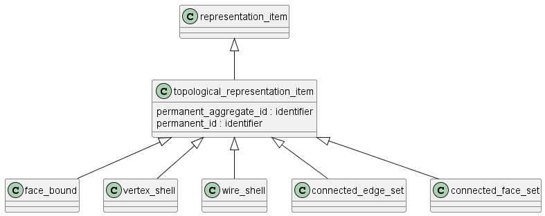

Схема topology на языке Express приведена в ISO 10303-42:2024. Ниже приводится описание применения данной схемы для описания топологии изделий, разрабатываемых в соответствии со стандартами СПЖЦ и ЕСКД.

Схема topology_schema предназначена для описания топологической структуры моделей изделий — то есть таких математических и информационных объектов, которые описывают взаимосвязи между объектами, но не включает точную геометрическую форму объектов. 

Назначение схемы

Схема позволяет однозначно и универсально описывать такие понятия как грани, кромки, вершины, оболочки (например, для CAD, CAM, 3D-моделирования и цифровых двойников).

Схема содержит:

- определение базовых топологических объектов вершины, ребра и грани, а также их подтипов для связи с геометрическими объектами точки, кривой или поверхности соответственно;
- 
- определение объектов ~~пути~~, петли и оболочки для формирования топологических структур и определение ограничений для обеспечения целостности данных структур;
- 
- определение связей между гранями и геометрическими формами;
- 
- определение ориентации топологических объектов.

Топологические объекты определены иерархически, начиная с объекта vertex, являющегося примитивным объектом, т. е. другие топологические объекты определяются прямо или косвенно через вершины.

Каждый объект имеет свой набор ограничений. Объект более высокого уровня может накладывать ограничения на объект более низкого уровня. Ограничения на более высоком уровне на объект более низкого уровня представляют собой сумму ограничений, налагаемых каждым объектом в цепочке между объектами более высокого и более низкого уровня. Основные топологические структуры в порядке возрастания сложности включают:

- **Вершина** (vertex, vertex_point) — точка, определяющая угловую или стыковую позицию.

- **Ребро** (edge, edge_curve, oriented_edge) — соединяет две вершины; может ссылаться на геометрическую кривую.

- **Петля** (loop, edge_loop, vertex_loop) — последовательность рёбер, образующих замкнутую границу грани.

- **Грань** (face, face_surface, oriented_face) — двумерная поверхность, ограничиваемая петлями ребер.

- **Оболочка** (shell, open_shell, closed_shell) — совокупность граней, формирующих замкнутую или открытую поверхность.

В дополнение к высокоуровневым структурированным топологическим объектам open_shell и closed_shell, которые являются специализированными подтипами connected_face_set, раздел топологии включает connected_edge_set и общий connected_face_set. Два указанных объекта предназначены для передачи коллекций топологических данных, где ограничения, применяемые к оболочке, являются неприменимыми.

Связанные множества (connected_face_set) — совокупность связанных граней, может описывать как оболочки, так и отдельные компоненты.

Ключевые связи:

- Вершины соединяются рёбрами.

- Рёбра группируются в петли, которые ограничивают грани.

- Грани формируют оболочки, которые объединяют все элементы в целостную структуру изделия.

Топологические объекты могут быть связаны с геометрическими объектами (например, ребро с кривой, грань с поверхностью).

Примеры применения:

В CAD-моделировании: построение твердотельных и поверхностных моделей, где topology_schema определяет каркас (wireframe, boundary representation) изделия: вершины — точки углов, рёбра — линии, грани — поверхности.

В 3D-печати: хранение и проверка замкнутости оболочек, поиска ошибок типа самопересечений или разрывов в модели.

В контроле качества: автоматическая проверка связности формы, корректности границ, соответствия реальной детали цифровой модели.

В анализе физических процессов: разбиение объекта на сетки (mesh generation) для вычислительных методов (CFD, FEM), где topology_schema формирует основы такой сетки.

Схема topology_schema позволяет разделять описание структуры изделия (какие элементы соединены) и его точную геометрию (как именно эти элементы выглядят), что обеспечивает мощную основу для интеграции и обмена данными между разными системами и задачами инженерии.

## Топологическое представление

Объект **элемент топологического представления** (topological_representation_item) является подтипом **элемента представления** (representation_item), который представляет топологию или связность объектов, составляющих представление объекта. Элемент topological_presentation_item является супертипом для всех элементов представления в схеме топологии.

## Вершина

Объект **вершина** (vertex) является подтипом элемента топологического представления (topological_presentation_item) и определяет топологическую конструкцию, соответствующую точке. Объект имеет размерность 0 и степень 0. 

(?)Область вершины, при наличии, является точкой в m-мерном реальном пространстве Rm и представлена подтипом vertex_point.

Топологическая вершина соответствует геометрической точке в m-мерном реальном пространстве Rm. Это соответствие описывается объектом vertex_point, атрибут которого vertex_geometry содержит ссылку на геометрическую точку, определяющую положение вершины в геометрическом пространстве.

## Ребро

Объект **ребро** (edge) является подтипом topological_representation_item, соответствующим соединению между двумя вершинами. Соединение может означать логическую связь между двумя вершинами. 

Область ребра (?), при наличии, представляет собой конечную открытую кривую (curve) без самопересечения в Rm, т. е. связное 1-многообразие. Кривая связана с ребром с помощью объъекта edge_curve.Кривая должна быть конечной и без самопересечения в области ребра.

Границы edge являются двумя вершинами (vertex), которые не обязательно должны быть различными. Ребро ориентируется путем выбора направления обхода от первой вершины ко второй. Если две вершины совпадают, ребро представляет собой петлю. Область ребра не включает его границы и 0 < Ξ < ∞.

Объект edge_curve является подтипом edge, геометрия которого полностью определена. Геометрия определяется путем связывания ребра с кривой curve, которая может быть неограниченной. Поскольку топологическое и геометрическое направления могут быть противоположными, используется флаг (same_sense) для определения того, совпадают ли направления ребра и кривой или противоположны. Логическое значение указывает, соответствует ли направление curve направлению edge (TRUE) или направления противоположны (FALSE). Любая геометрия, связанная с вершинами edge, должна соответствовать геометрии edge. На одну и ту же кривую могут ссылаться несколько ребер.

## Петля

Объект **петля** (loop) является подтипом topological_representation_item, построенным из одной вершины или путем объединения связанных (ориентированных) ребер или линейных сегментов, начинающихся и заканчивающихся в одной и той же вершине. Петля имеет размерность 0 или 1. Область 0-мерной петли является отдельной точкой. Область 1-мерной петли является связной ориентированной кривой, но не обязательно многообразием. Поскольку петля является циклом, расположение ее начальной / конечной точки может быть произвольным. Область определения петли включает ее границы, 0 ≤ Ξ < ∞.
Петля представляется одной вершиной, упорядоченным набором oriented_edge, или упорядоченным набором точек.

Объект vertex_loop является подтипом loop нулевого рода, состоящего из одной вершины. vertex может существовать независимо от vertex_loop. 

Объект edge_loop является подтипом loop с ненулевой степенью. Объект является объектом path, в котором начальная и конечная вершины совпадают. Область объекта, при наличии, представляет собой замкнутую кривую. Объект edge_loop может перекрывать себя. - *нужен? это подтип path, который вроде не описываем*

Объект poly_loop является подтипом loop с прямыми ребрами, ограничивающими плоскую область в пространстве. Объект poly_loop – это loop рода 1, в котором loop представлен упорядоченным копланарным набором point, образующих вершины петли. Петля состоит из прямых отрезков, соединяющих точку в коллекции с последующей точкой в коллекции. Закрывающий сегмент идет от последней до первой точки в коллекции. Направление петли – в направлении отрезков линии. В отличие от объекта loop, ребра poly_loop неявно определяются точками polygon.

## Грань

Объект **грань** (face) является подтипом topological_representation_item размерности 2, представляющим часть поверхности, ограниченной петлями. 

Область объекта, при наличии, является ориентированным связным конечным 2-многообразием в Rm. 

Область грани не должна иметь ручек, но может иметь отверстия, каждое из которых ограничено петлей. 

Область базовой геометрии грани, при наличии, не содержит ее границ, и 0 < Ξ <∞. 

Грань представлена ограничивающими петлями, которые определены как face_bounds. Грань должна иметь по крайней мере одну границу, границы должны быть различными и не иметь самопересечений. 

Один объект loop может быть определен с использованием подтипа face_outer_bound в качестве «внешней» петли грани. В таком случае объект определяет предпочтительный способ встраивания области грани в плоскость, в которой другие ограничивающие петли грани находятся «внутри» внешней петли. Поскольку область грани является линейно связанной, никакая внутренняя петля не должна содержать других петель в независимости от того, какое вложение в плоскость выбрано.

Геометрическая поверхность surface может быть связана с гранью двумя способами: явно с помощью подтипа face_surface или неявно, если грани определены с помощью poly_loops. В последнем случае поверхность – это плоскость, содержащая точки poly_loops. В любом случае топологическая нормаль n связана с гранью так, что векторное произведение n × t направлено внутрь грани, где t – касательная к ограничивающей петле. Таким образом, каждая петля проходит против часовой стрелки вокруг грани при взгляде сверху, если считать, что нормаль n направлена вверх. 

Каждая петля связана через объект face_bound с булевым флагом для указания совпадения направления петли относительно нормали грани (TRUE) или противоположности направления (FALSE). Для грани подтипа face_surface топологическая нормаль n определяется из нормали к нижележащей поверхности вместе с булевым атрибутом same_sense, и это, в свою очередь, определяет, на какой стороне петли находится внутренняя часть грани, с использованием вышеописанного правила векторного произведения.

Объект face_surface является подтипом face, геометрия которого определяется связанным объектом surface. Часть поверхности, используемая гранью, должна быть встроена в плоскость в виде открытого диска, возможно с отверстиями. Объединение грани с ребрами и вершинами ее ограничивающих петель не обязательно должно быть вложено в плоскость. Например, объединение может покрывать всю сферу или тор. Поскольку и грань, и геометрическая поверхность имеют определенные направления нормали, используется булев флаг (атрибут ориентации) для указания соответствия нормали поверхности направлению нормали грани (TRUE) или противоположности нормалей (FALSE). Геометрия, связанная с любым компонентом петель грани, должна соответствовать геометрии поверхности в том смысле, что области всех вершинных точек и кривых ребер содержатся в поверхности геометрической формы грани. На объект surface может быть ссылка более одного объекта face_surface.

## Оболочка

Тип shell является списком дополнительных типов данных и предоставляет механизм для ссылки на экземпляр одного из этих типов данных.

Тип shell собирает подтипы, которые имеют характеристики оболочки, для создания ссылки на них при построении более сложных моделей.

Тип shell является связанным объектом фиксированной размерности d, равной 0, 1 или 2, и обычно используется для ограничения области. Область определения оболочки, при наличии, включает ее границы и 0 ≤ Ξ <∞.

Оболочка размерности 0 представляется графом, состоящим из единственной вершины. Вершина не должна иметь связанных ребер.
Оболочка размерности 1 представляется связным графом размерности 1.

Оболочка размерности 2 – это топологический объект, построенный путем соединения граней по ребрам. Его область определения, при наличии, представляет собой связное ориентируемое 2-многообразие с границей, т. е. связную ориентированную конечную поверхность без самопересечения, которая может быть замкнутой или открытой.
