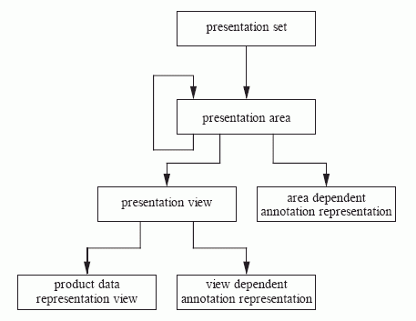
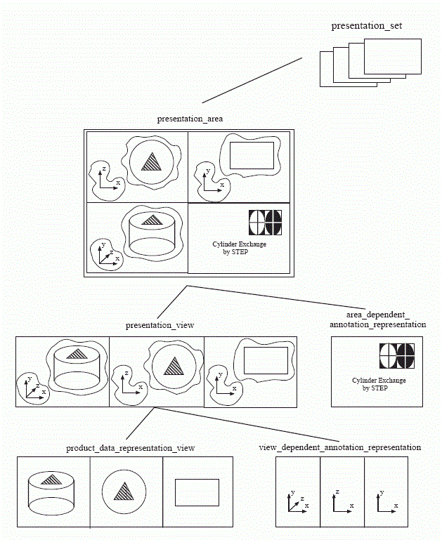
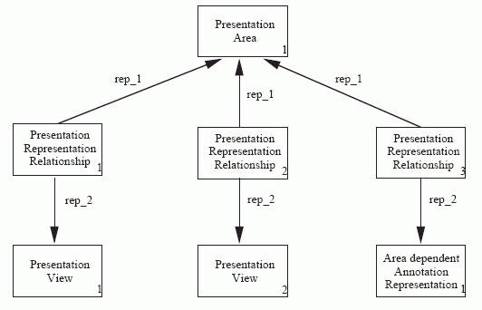
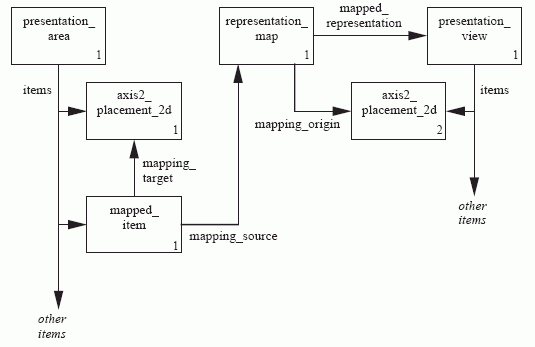

## Presentation organization schema

### 0 Термины (как по русски назвать используемые понятия):

**Presentation** - 

**presentation set** - 

**presentation area** - 

**presentation view** - 

**area dependent annotation representation** - 

**product data representation view** - 

**view-dependent annotation representation** - 

### 1 Общие положения
Схема presentation_organization предоставляет структуру для управления изображением и его компонентами. Она также определяет взаимосвязь между свойствами изделия и их представлением на изображении. **Компоненты изображения** могут быть связаны друг с другом либо как связь между двумя компонентами, которые в остальном независимы, либо как один компонент, который является элементом определения другого. Эти связи позволяют создавать сложные структуры изображений и компонентов.

Компоненты изображения могут быть организованы в иерархию, состоящую из наборов презентаций (presentation sets), областей презентации (presentation areas), представлений аннотаций, зависящих от областей (areas dependent annotation representations), видов презентаций (presentation views), представлений аннотаций, зависящих от вида (view dependent annotation representations), и видов представлений данных о продукте (product data representation views). Иерархия состоит из следующих четырех уровней:

- **Уровень 1: набор презентаций (presentation set)**. Набор презентаций представляет собой набор независимых рисунков (pictures), посвященных одной и той же теме. Примерами наборов презентаций являются наборы листов с рисунками или коллекция изображений нескольких экранов дисплея. Набор презентаций состоит из одной или нескольких областей презентации (presentation areas).

- **Уровень 2: область презентации (presentation area)**: Область презентации - это обобщение отображения (generalization of a display), представляющее собой отдельную область на экране дисплея или устройстве. Область презентации содержит любое количество областей презентации, видов презентации (presentation views) и представлений аннотаций, зависящих от вида (area-dependent annotation representations).

- **Уровень 3: вид презентации (presentation view)**: Вид презентации - это двумерное представление формы продукта, которое включает в себя любые (все?)аннотации, связанные с этим видом. Вид презентации содержит любое количество видов представлений данных о продукте (product data representation views) и  представлений аннотаций, зависящих от вида (view-dependent annotation representations).

**представление аннотаций, зависящих от области (area dependent annotation representation)**. Это все аннотации с областью представления (is all annotation with a presentation area).

- **Уровень 4: вид представления данных о продукте (product data representation view)**. Это двумерное представление формы изделия, которое включает в себя любые аннотации, связанные с формой изделия.

**представление аннотаций, зависящее от вида (view-dependent annotation representation)**: Это аннотации, связанные с видами представлений (presentation view).

Реальная иерархия презентации может содержать больше уровней, чем описано выше. Одна область презентации может состоять из нескольких других областей презентации. Иерархия презентации может также содержать меньше уровней, чем описано выше, поскольку некоторые компоненты, составляющие иерархию, не требуются.

ПРИМЕЧАНИЕ 1 На рисунках 2 и 3 показаны взаимосвязи между уровнями иерархии презентации.

### 2 Иерархия презентаций

В иерархии презентаций только область презентации (presentation area) содержит информацию, достаточную для однозначного создания изображения с помощью подходящего устройства вывода, такого как экран компьютера, принтер или плоттер.

Другие элементы иерархии не содержат информации, необходимой для правильного размещения на устройстве отображения. Виды презентации (presentation view) или другие компоненты более низкого уровня отображаются только в том случае, если они прямо или косвенно связаны с областью презентации.

Схема presentation_organization описывает иерархию презентации посредством представления (representation) различных элементов иерархии и взаимосвязей между ними.

ПРИМЕЧАНИЕ 1 Концепции представления ((representation)) и взаимосвязей между представлениями описаны в стандарте ISO 10303-43.

Каждый элемент иерархии презентации описывается с помощью объекта presentation_representation, являющегося подтипом представления. Подтипы объекта presentation_representation описывают различные элементы в иерархии.

ПРИМЕЧАНИЕ 2 Объект представления определен в стандарте ISO 10303-43.

Контекст каждого элемента иерархии презентации описывается с использованием объекта geometric_representation_context; он должен быть двумерным.

ПРИМЕЧАНИЕ 3. Объект geometric_representation_context определен в стандарте ISO 10303-42.

Содержимое каждого элемента иерархии представления описывается набором элементов каждой презентации. Элементы представляют собой либо двумерную геометрию, либо аннотацию, которые должны быть представлены в элементе, либо результаты включения других элементов.

Некоторые элементы иерархии ограничены в отношении своего содержимого или отношений, которые они могут иметь с другими элементами. С этими ограничениями связана определенная семантика; например, сущность product_data_representation_view описывает элемент иерархии, который включает только результаты проектирования трехмерной геометрии или аннотации.

Самый верхний уровень иерархии презентаций представлен сущностями presentation_set, presentation_area и area_in_set. Сущность area_in_set поддерживает отношения "многие ко многим" между наборами презентаций и областями презентаций.

Другие элементы иерархии презентации связаны друг с другом с помощью объекта presentation_representation_relationship или объектов mapped_item и representation_map.

ПРИМЕЧАНИЕ 4 Объекты mapped_item и representation_map определены в стандарте ISO 10303-43.

Связь между двумя элементами иерархии, которые определены независимо, описывается с использованием сущности presentation_representation_relationship. Это описывает взаимосвязь между двумя экземплярами объекта presentation_representation; в этой взаимосвязи один объект presentation_representation обозначается как родительский, а другой - как дочерний. Описание преобразования включено в отношение; это преобразование представляет собой геометрическое соотношение между элементами родительского presentation_representation и элементами дочернего presentation_representation.

ПРИМЕР 1. Чтобы определить иерархию, состоящую из одного presentation_area, двух presentation_views и одного area_dependent_annotation_representation, требуются три экземпляра presentation_representation_relationship, как показано на рисунке 4.

Связь между двумя элементами иерархии, где один участвует в определении другого, описывается с помощью объектов mapped_item и representation_map.

Такая связь описывается экземпляром объекта mapped_item. Этот экземпляр включен в качестве одного из элементов presentation_representation, который содержит другой. На второе presentation_representation ссылаются как на mapped_representation для representation_map, которое указано как mapping_source для mapped_item. Преобразование, которое описывает геометрическую взаимосвязь между элементами двух presentation_representations, описывается с помощью mapping_target для mapped_item и mapping_origin для representation_map.

ПРИМЕР 2 Для включения presentation_view в presentation_area требуется один экземпляр mapped_item, один экземпляр representation_map и два экземпляра axis2_placement_2d, которые выступают в качестве источника и целевого объекта для отображения, как показано на рисунке 5.

ПРИМЕЧАНИЕ 5 Объект axis2_placement_2d определен в стандарте ISO 10303-42.

### 3 Модель камеры и проекция

Каждый уровень иерархии представления состоит только из двумерной геометрии или аннотаций. Ориентация по умолчанию такова, что первая координата, определяющая положительную ось x, направлена вправо, а вторая координата, определяющая положительную ось y, направлена вверх. Необходимо указать трехмерную синтетическую модель камеры (synthetic camera model), чтобы связать презентацию с трехмерной формой продукта или плоскостной аннотацией в трехмерном пространстве. Эта модель определяет, как система отображения должна выполнять проекцию трехмерной геометрии и аннотации в двух измерениях. Трехмерная синтетическая модель камеры определена по аналогии с графическими стандартами GKS-3D и PHIGS. Более подробную информацию о синтетической модели камеры можно найти в [6], [11] и в литературе по компьютерной графике, например, в [14] или [15]. Для создания чертежей также поддерживается двумерная модель камеры. Эта двумерная модель выполняет масштабирование и трансляцию в двумерном пространстве.

product_data_representation_view - это единственный компонент иерархии представления, который может состоять из двумерных проекций соответствующей трехмерной формы продукта или аннотаций в трехмерном пространстве. Поскольку в этом документе определяется не проецируемое изображение, а вся информация, необходимая для вычисления проекции, только заполнитель для этого изображения является частью product_data_representation_view. Этот заполнитель называется camera_image и относится к модели камеры и двумерным или трехмерным элементам формы изделия или аннотации.

Чтобы обеспечить более реалистичное представление трехмерных объектов, для трехмерной модели камеры можно задать удаление скрытых линий и поверхностей, а также источников света.

### 4 Слои (Layers)

Слой - это набор элементов формы изделия, элементов аннотаций или компонентов иерархии презентации, сгруппированных с целью управления видимостью и стилем (visibility and style). Набор всех элементов, связанных со слоем, может быть определен как видимый или невидимый в рамках компонента иерархии презентации. Один элемент может быть связан с несколькими слоями, и один слой может использоваться в нескольких компонентах иерархии презентации. Для элемента, связанного с несколькими слоями, каждому слою может быть назначен свой стиль презентации (presentation style). Слой определяется параметром presentation_layer_assignment. Видимость и назначение стиля для данного слоя в компоненте иерархии презентации определяются параметром presentation_layer_usage.

### 5 Связь презентации с моделью продукта (Association of presentation with a product model)

Этот документ позволяет связать информацию резентации с информацией изделии, которое показано в этой презентации. Эта связь достигается за счет использования presented_item_representation. Этот объект связывает изделие с презентацией этого изделия. Представленный элемент должен быть специализирован в соответствии с прикладными протоколами.

ПРИМЕР 3 Изделием, показанным в презентации, может быть дизайн кузова автомобиля, схема электронного чипа или архитектура здания.